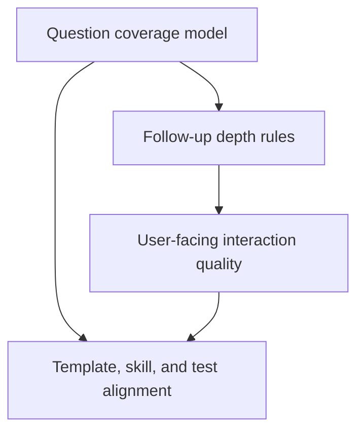

# Feature Landscape: Stronger `sp-specify` Questioning

**Domain:** Requirement discovery and clarification quality in `specify`
**Researched:** 2026-04-13

## Table Stakes

Capabilities users now reasonably expect from `/sp.specify` after the analysis-first redesign.

| Capability | Why Expected | Complexity | Notes |
|------------|--------------|------------|-------|
| **Coverage of core requirement dimensions** | Users expect `specify` to ask about missing scope, users, constraints, and success conditions before planning | Medium | Current user feedback says this still feels too thin |
| **High-value follow-up questions** | The workflow should challenge vague answers instead of accepting surface statements | Medium | Stronger follow-up depth is the main requested improvement |
| **Structured but readable interaction** | Users want guidance, not a wall of freeform questioning | Low | Keep the question-card/open-block discipline |
| **Substantive confirmation gate** | Users need a stronger checkpoint before the workflow declares the spec aligned | Low | Mirrors one of the strongest qualities in `superpowers` |
| **Consistent shipped behavior across templates and skill mirrors** | A user should not get different questioning behavior depending on the generated surface they actually run | Medium | Current repo has drift here |

## Differentiators Worth Borrowing

These are the qualities in `superpowers` that seem most valuable to absorb into `specify` without changing the mainline workflow.

| Differentiator | Value | Complexity | Notes |
|----------------|-------|------------|-------|
| **Intent-following questioning** | Questions feel responsive to what the user emphasized, not like a fixed questionnaire | Medium | Best candidate for improving perceived quality |
| **One-question-at-a-time discipline with depth** | Maintains focus while still exploring ambiguities thoroughly | Medium | Compatible with the current `specify` clarification loop |
| **Purpose-aware probing** | Questions are clearly tied to outcome, constraint, or success criteria rather than generic categorization | Medium | Helps users feel the system is “thinking” |
| **Stronger pre-exit validation** | Prevents the workflow from ending while major requirement gaps remain | Low | Fits the alignment-ready gate already present |

## Anti-Features

Changes that would look attractive but would miss the point of the milestone.

| Anti-Feature | Why Avoid | Better Alternative |
|--------------|-----------|-------------------|
| **Just add more questions everywhere** | Quantity alone will make the workflow slower without improving clarity | Make question selection more adaptive and high-value |
| **Replace `specify` with freeform brainstorming** | Conflicts with the preferred structured experience and current product direction | Keep structure, upgrade the questioning logic inside it |
| **Optimize only the card visuals** | Solves presentation symptoms, not requirement-discovery quality | Improve question depth, sequencing, and confirmation logic |
| **Scope creep into `clarify` / `spec-extend`** | Diffuses the milestone and delays mainline improvement | Limit the milestone to `sp-specify` |

## Suggested Capability Groups

These groups are the most natural requirement buckets for the milestone.

1. **Question Coverage**
   Ensures the workflow reliably surfaces missing requirement dimensions.
2. **Follow-up Depth**
   Ensures vague or shallow answers trigger better next questions.
3. **Experience Quality**
   Ensures the interaction feels guided and coherent rather than mechanical.
4. **Artifact Alignment**
   Ensures templates, generated skills, and tests all ship the same contract.

## Dependencies

## Recommendation

The first-release slice should include all four capability groups above. Cutting any one of them would likely leave the user with partial improvement and a continued “looks better than it feels” outcome.
