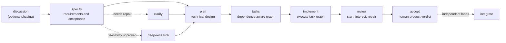

# Spec Kit Plus

**Spec-Driven Development workflows for local AI coding agents—from product intent to reviewed specifications, plans, tasks, implementation, integrated system review, and human acceptance.**

[](https://github.com/chenziyang110/spec-kit-plus/releases)
[](https://github.com/chenziyang110/spec-kit-plus/actions/workflows/test.yml)
[](pyproject.toml)
[](LICENSE)

[Quick start](#quick-start) · [How it works](#how-it-works) · [Workflow profiles](#workflow-profiles) · [Integrations](#supported-integrations) · [Documentation](#documentation) · [Releases](https://github.com/chenziyang110/spec-kit-plus/releases)

Spec Kit Plus is an independently developed Spec-Driven Development toolkit for local AI coding agents. The `specify` CLI scaffolds a shared runtime and renders native commands or skills for the AI coding tool you select. The generated workflows then carry decisions through requirements, technical planning, execution, verification, and acceptance.

> [!IMPORTANT]
> Spec Kit Plus has its own templates, workflow profiles, runtimes, and release behavior. Install from `chenziyang110/spec-kit-plus` when you want the capabilities documented here. [GitHub Spec Kit](https://github.com/github/spec-kit) remains a separate project with its own canonical distribution.

## Why Spec Kit Plus

| Need | What this repository provides |
| --- | --- |
| Keep product intent intact | A reviewable artifact chain from `specify` through `plan`, `tasks`, `implement`, system `review`, and `accept`, with explicit repair and reopen paths. |
| Work in the agent you already use | One integration registry renders the same workflow concepts into skills, commands, prompts, hooks, and context files native to each supported tool. |
| Match prompts to the model | **Classic** keeps the full, explicit `sp-*` workflow; **Advanced** provides independent, prompt-optimized `spx-*` skills for skills-based integrations. |
| Navigate an existing codebase | Project Cognition narrows brownfield evidence reads and change-impact routes while requiring live repository verification before technical claims or edits. |
| Treat UI and acceptance as executable work | `DESIGN.md`, feature `ui-brief.md`, task-local UI contracts, real-entrypoint evidence, and resumable human acceptance remain part of delivery rather than optional prose. |
| Extend without forking the runtime | Presets, extensions, a generic integration, project Learning, and optional team execution add capabilities around the shared CLI and artifact contracts. |

## Quick start

### Recommended setup

- [Python 3.11 or newer](https://www.python.org/downloads/)
- [uv](https://docs.astral.sh/uv/getting-started/installation/)
- [Git](https://git-scm.com/downloads) (recommended; `init --no-git` is available)
- the CLI or IDE for your chosen AI coding agent

### 1. Install the CLI

```bash
uv tool install specify-cli --from git+https://github.com/chenziyang110/spec-kit-plus.git
```

An untagged Git install follows the current development head. For a reproducible
CLI/runtime pair, append a tag from
[Releases](https://github.com/chenziyang110/spec-kit-plus/releases) to the Git
URL, for example `@vX.Y.Z`.

### 2. Initialize a project

```bash
specify init my-project --ai codex --workflow-profile classic
cd my-project
specify check
```

`specify init` creates the shared `.specify/` runtime and the native workflow catalog for the selected integration. `classic` is the non-interactive default; choose `advanced` when the integration supports skills and you want the independent `spx-*` catalog.

To scaffold once without installing the CLI:

```bash
uvx --refresh --from git+https://github.com/chenziyang110/spec-kit-plus.git specify init my-project --ai codex --workflow-profile classic
```

For an existing directory, run `specify init --here --force --ai <agent>` after reviewing local changes. Use `--ignore-agent-tools` when you only want the generated assets and do not want `init` to require the selected agent executable.

### 3. Start the workflow in your agent

The following is Codex skill syntax and is entered inside Codex, not in the shell:

```text
$sp-specify Build a searchable knowledge base with role-based access and an audit trail.
$sp-plan Use PostgreSQL, a REST API, and the existing frontend stack.
$sp-tasks
$sp-implement
$sp-review
$sp-accept
```

Other integrations use different punctuation. The `Start Here` panel printed by `specify init` shows the exact native commands for the selected agent.

## How it works

The normal pre-planning path is `specify -> plan`. Clarification and feasibility research are conditional branches, not mandatory ceremony.



- Use `discussion` before formal specification when an idea still needs product or technical shaping.
- Use `clarify` only when an existing specification needs deeper analysis before planning.
- Use `deep-research` when requirements are clear but feasibility, external evidence, or an implementation chain still needs proof before planning.
- Review the seeded constitution and run `constitution` when the project needs explicit governance changes.
- Use `auto` to resume the safest next step from recorded workflow state.

### Workflow catalog

| Layer | Canonical workflows |
| --- | --- |
| Core workflow skills | `constitution`, `specify`, `plan`, `tasks`, `implement`, `review`, `accept` |
| Support skills | `auto`, `ask`, `discussion`, `clarify`, `deep-research` (`research` compatibility alias), `design`, `fast`, `quick`, `checklist`, `analyze`, `debug`, `explain`, `integrate`, `implement-teams`, `prd-scan`, `prd-build`, `prd` (deprecated compatibility entrypoint), `map-scan`, `map-build`, `map-update`, `taskstoissues` |
| Codex-only runtime | `sp-teams` for durable managed-team state and `team` for runtime operations inside the generated agent catalog |

The generated `ask` workflow is read-only, evidence-backed project Q&A. `prd-scan -> prd-build` reconstructs current product documentation from an existing repository and is a peer workflow, not an automatic handoff to `plan`.

## Workflow profiles

| | Classic | Advanced |
| --- | --- | --- |
| Best fit | Broad compatibility and explicit guidance | Advanced models that can operate from compact, independently owned skills |
| Availability | Every integration | Skills-based integrations only |
| Generated surface | Agent-native `sp-*` skills or `/sp.*` commands | Independent `spx-*` skills plus the original Classic map companions |
| Prompt policy | Full tutorials, recovery guidance, and compatibility detail | Removes repetition and stable boilerplate while preserving state, recovery, side-effect, and final-claim gates |
| Default | Non-interactive default | Explicit opt-in with `--workflow-profile advanced` |

Advanced optimization has **no hard word or token ceiling**. It optimizes expression only after preserving workflow semantics. An Advanced install also includes the unchanged Classic `sp-map-scan`, `sp-map-build`, and `sp-map-update` companions so a lower-cost model can run the more explicit map workflow.

Install either profile explicitly:

```bash
specify init my-project --ai codex --workflow-profile classic
specify init another-project --ai codex --workflow-profile advanced
```

Profiles are additive for a skills-based integration. To keep both in one project:

```bash
specify init my-project --ai codex --workflow-profile classic
cd my-project
specify init --here --force --ai codex --workflow-profile advanced
```

Canonical workflow names are integration-neutral. Invocation syntax depends on the integration:

| Integration surface | Classic `specify` | Advanced `specify` | PRD reconstruction |
| --- | --- | --- | --- |
| Codex, Antigravity, Trae, and ZCode skills | `$sp-specify` | `$spx-specify` | `$sp-prd-scan -> $sp-prd-build` |
| Claude, Cursor, and Mistral Vibe skills | `/sp-specify` | `/spx-specify` | `/sp-prd-scan -> /sp-prd-build` |
| Kimi Code skills | `/skill:sp-specify` | `/skill:spx-specify` | `/skill:sp-prd-scan -> /skill:sp-prd-build` |
| Slash-dot command integrations | `/sp.specify` | Not available | `/sp.prd-scan -> /sp.prd-build` |

`/sp-*` is not universal for skills-backed integrations. Use the invocation form generated for your selected tool—for example `$sp-plan`, `/skill:sp-plan`, or `/sp.plan`.

## Supported integrations

The current registry is the source of the following integration keys:

| Surface | Integration keys |
| --- | --- |
| Skills-based; Classic and Advanced | `agy`, `claude`, `codex`, `cursor-agent`, `kimi`, `trae`, `vibe`, `zcode` |
| Command, prompt, or workflow based; Classic | `amp`, `auggie`, `bob`, `codebuddy`, `copilot`, `forge`, `gemini`, `iflow`, `junie`, `kilocode`, `kiro-cli`, `mimo`, `opencode`, `pi`, `qodercli`, `qwen`, `roo`, `shai`, `tabnine`, `windsurf` |
| Bring your own agent | `generic` with `--ai-commands-dir <directory>` |

Run `specify init --help` for the authoritative list shipped by the installed CLI. `specify integration list` inspects integrations already installed in a generated project; it is not the pre-init discovery command.

## Installation, upgrade, and repair

| Goal | Command or guide |
| --- | --- |
| Persistent Git install | `uv tool install specify-cli --from git+https://github.com/chenziyang110/spec-kit-plus.git` |
| One-time execution | `uvx --refresh --from git+https://github.com/chenziyang110/spec-kit-plus.git specify ...` |
| Upgrade to the current repository head | `uv tool install specify-cli --force --from git+https://github.com/chenziyang110/spec-kit-plus.git` |
| Pin a release | Append `@vX.Y.Z` from [Releases](https://github.com/chenziyang110/spec-kit-plus/releases) to the Git URL |
| Repair runtime-managed generated assets | `specify integration repair` from the generated project root |
| Diagnose tools and project compatibility | `specify check` |
| Troubleshoot installation and PATH | [Installation Guide](docs/installation.md) and [Upgrade Guide](docs/upgrade.md) |

`specify version` reports package and interpreter information, but development installs can share the same `.dev0` version across commits. Verify the active command surface with `specify --help`; on Windows, use `Get-Command specify -All` to find stale pip, Conda, or uv entrypoints that may shadow the intended executable.

Core scaffolding assets are bundled in the Python package. Tagged releases also
publish matching prebuilt `specify-runtime` binaries for Windows, Linux, and
macOS. `specify init` downloads and pins the matching runtime when possible and
reports a recovery path when the best-effort install is unavailable.

If `cognition init-empty` reports `unsupported_legacy_runtime`, a legacy
`.specify/project-cognition/` store is blocking the current schema; it does not
mean the runtime binary is missing. Archive that directory first (or remove it
only after confirming it is disposable), then rerun initialization for an empty
project or run `sp-map-scan -> sp-map-build` for an existing codebase.

## Documentation

| Goal | Read |
| --- | --- |
| Complete the first workflow | [Quick Start Guide](docs/quickstart.md) |
| Install, pin, or troubleshoot the CLI | [Installation Guide](docs/installation.md) |
| Upgrade the CLI or a generated project | [Upgrade Guide](docs/upgrade.md) |
| Understand architecture and change propagation | [Project Handbook](PROJECT-HANDBOOK.md) |
| Maintain workflow/profile product contracts | [Repository agent guidance](AGENTS.md) |
| Choose project governance defaults | [Constitution Profiles](docs/constitution-profiles.md) |
| Develop an extension | [Extension Development Guide](extensions/EXTENSION-DEVELOPMENT-GUIDE.md) and [API Reference](extensions/EXTENSION-API-REFERENCE.md) |
| Build or publish presets | [Preset Guide](presets/README.md) and [Publishing Guide](presets/PUBLISHING.md) |
| Develop this repository | [Local Development Guide](docs/local-development.md) |
| Review workflow quality evidence | [Workflow Quality](docs/workflow-quality/README.md) |

## Project scope

- Python support starts at 3.11; CI exercises Python 3.11, 3.12, and 3.13.
- Generated automation includes Bash and PowerShell variants.
- Classic and Advanced are separate prompt products over shared CLI, schema, validator, and artifact contracts.
- In a terminal, the optional Codex team runtime is operated through `specify sp-teams ...`; inside Codex, `$sp-teams` is the generated skill entrypoint.
- The current `sp-teams` scope is Codex-only and optional. Other integrations do not receive the Codex team runtime by default.
- Project Cognition is advisory navigation, not repository truth: map points, code proves.

## Community and contributing

- Ask focused usage questions, report reproducible bugs, or propose features through [GitHub Issues](https://github.com/chenziyang110/spec-kit-plus/issues).
- Check [Releases](https://github.com/chenziyang110/spec-kit-plus/releases) before reporting an issue against an older build.
- Read the [Local Development Guide](docs/local-development.md) and the repository [pull request template](.github/PULL_REQUEST_TEMPLATE.md) before submitting a change.

The primary local verification loop is:

```bash
uv sync --extra test
uvx ruff check src/
uv run pytest -n auto
```

Pull requests should describe the change, record verification, and disclose AI assistance as requested by the repository template.

## License and acknowledgements

Spec Kit Plus is distributed under the [MIT License](LICENSE). It builds on [GitHub Spec Kit](https://github.com/github/spec-kit) and retains its upstream copyright notice.

## Maintainer reference

The repository's regression suite treats the detailed workflow and runtime rules below as a user-visible product contract. They remain searchable here but are collapsed so the primary README path stays focused on evaluation and first success.

<details>
<summary><strong>Expand the full workflow and runtime contract reference</strong></summary>

## Full product contract reference

`spec-kit-plus` is an independently developed Spec-Driven Development system focused on practical workflow support for local AI coding agents.

`specify` is the setup and management CLI. Inside a generated project, the
agent-native `sp-specify` / `spx-specify` workflow runs the brainstorming lock
flow, persists facts, route, and intent truth, and produces the structured
handoff for `plan`; later stages continue through `tasks`, `implement`,
integrated system `review`, and human `accept`.

This repository contains:

- the `specify` CLI
- built-in spec, plan, tasks, and implement templates
- agent integrations for tools such as Codex, Claude, Gemini, Copilot, Cursor, Windsurf, Kimi, MiMo Code, Forge, and others
- the bundled scripts and assets used by `specify init`

Project cognition navigation responses expose a machine-readable `epistemic_contract` with `graph_role=route_candidate_only`, `fact_source_of_truth=live_repository`, `live_verification_required=true`, `graph_only_claims_allowed=false`, and `unverified_claim_action=withhold`. The graph narrows evidence reads; it cannot authorize source changes or prove current behavior, and contradictory live evidence overrides the route candidate.

Graph claims are indexed assertions. Their lifecycle is `candidate`, `supported`, `verified_in_graph_generation`, `contradicted`, or `stale`; even `verified_in_graph_generation` is scoped to the active graph generation and is not current repository truth. Graph claims cannot authorize source changes and cannot set workflow `claim_ready=true`; bounded live evidence, matching workflow verification, and explicit final-claim authorization remain separate requirements.

Schema v5 adds revision-bound, expiring reconciliation to the auditable live feedback loop and current evidence basis while retaining superseded claim evidence as history. When claim-specific bounded reads settle a stale or contradicted route, provide semantic intent only and run `specify-runtime cognition claim-reconcile prepare --input <intent.json> --format json`; the runtime owns every integrity field and returns the prepared packet path plus structured `apply_argv`. Execute that argv through `specify-runtime cognition claim-reconcile apply --input <prepared_packet_path> --format json`, then rerun Compass once on ready. Reconciliation remains route-candidate evidence and never grants workflow final-claim authorization. Schema v5 is current-only and does not migrate schema v4 or older databases.

## Install

### Persistent install

Install the CLI from this repository:

```bash
uv tool install specify-cli --from git+https://github.com/chenziyang110/spec-kit-plus.git
```

Upgrade to the latest Spec Kit Plus version. If a machine previously installed
`specify-cli` through `pip`, Conda, or another `uv tool` location, remove the old
entry first so a stale `specify.exe` does not shadow the new one:

```powershell
python -m pip uninstall -y specify-cli
uv tool install specify-cli --force --from git+https://github.com/chenziyang110/spec-kit-plus.git
Get-Command specify -All
specify --help
```

`specify version` reports the package version, but development installs can share
the same `.dev0` version string across commits. Use `specify --help` to confirm
the expected command surface, and use `Get-Command specify -All` on Windows to
detect duplicate old entrypoints.
Feature creation follows `sp-specify` plus the generated create-feature script
at `.specify/scripts/bash/create-new-feature.sh` or
`.specify/scripts/powershell/create-new-feature.ps1`; do not assume a separate
`specify create-feature` command family exists. Generated feature workspaces
default to `YYYY-MM-DD-<slug>` names; numeric prefixes are legacy and require
the script's explicit `--number` / `-Number` option.

### One-time use without installing

```bash
uvx --refresh --from git+https://github.com/chenziyang110/spec-kit-plus.git specify init my-project --ai codex
```

Initialize the current directory with the latest repository version, without relying on whatever `specify` is currently on your `PATH`:

```bash
uvx --refresh --from git+https://github.com/chenziyang110/spec-kit-plus.git specify init . --ai codex
```

### Local editable install for development

```bash
git clone https://github.com/chenziyang110/spec-kit-plus.git
cd spec-kit-plus
uv sync --extra test
uv run specify --help
```

## Prerequisites

- Python 3.11+
- `uv`
- `git`
- your target AI agent CLI or IDE integration

## Classic quick-start contract

Create a new project:

```bash
specify init my-project --ai codex
```

Skills-based integrations offer one workflow prompt profile per init run:

```bash
# Current full workflow skill set (default for non-interactive compatibility)
specify init my-project --ai codex --workflow-profile classic

# Concise, independent SPX skills for advanced models
specify init my-project --ai codex --workflow-profile advanced
```

Interactive init asks which profile to install. One run installs exactly one
profile. To keep both in the same project, run init again with `--here --force`
and select the other profile; the second run adds it without removing the first.
The advanced profile is available only for skills-based integrations.

Use a non-default built-in constitution profile when the repo needs a different
governance default:

```bash
specify init my-project --ai claude --constitution-profile library
```

Initialize the current directory:

```bash
specify init --here --ai codex
```

If the current directory is not empty:

```bash
specify init --here --force --ai codex
```

Generated projects may also persist a trusted project launcher in
`.specify/config.json` under `specify_launcher`. When that launcher exists,
first-party runtime helper instructions should follow it instead of assuming the
first `specify` executable on PATH is the correct one.

Validate generated-project runtime health and repair stale generated assets:

```bash
specify check
specify integration repair
```

`specify check` now reports:

- missing or broken persisted project launchers
- stale generated PowerShell workflow scripts that still rely on exact branch-to-feature-dir matching
- stale Claude hook commands that still use shell-parsed direct Python, POSIX, cmd, or PowerShell-style launchers instead of the shell-free Node launcher
- personal Claude workflow skills (`sp-*` / `spx-*`) whose names collide with project-installed Spec Kit skills; Claude gives the personal copy precedence, so this is a repairable block rather than a harmless duplicate

`specify integration repair` refreshes shared/runtime-managed generated assets in place
without overwriting user-edited workflow or skill content. It never moves or
rewrites personal Claude skills. When a collision is reported, back up and move
the matching directory out of `~/.claude/skills/` (or
`$CLAUDE_CONFIG_DIR/skills/`), fully restart Claude Code, and rerun
`specify check`.

Validate the installation:

```bash
specify --help
specify check
```

## Common Agent Examples

Codex:

```bash
specify init my-project --ai codex
```

Claude:

```bash
specify init my-project --ai claude
```

Claude project-local installs now write `.claude/skills/` as before and also
install thin native hook adapters under `.claude/hooks/`. When
`.claude/settings.json` is absent, it is created; when it already exists and is
valid JSON, managed hook registrations are merged without overwriting unrelated
user settings.

If a generated Claude project on Windows still has stale hook commands, run:

```bash
specify integration repair --script ps
```

Gemini:

```bash
specify init my-project --ai gemini
```

Copilot:

```bash
specify init my-project --ai copilot
```

Cursor:

```bash
specify init my-project --ai cursor-agent
```

ZCode:

```bash
specify init my-project --ai zcode
```

MiMo Code:

```bash
specify init my-project --ai mimo
```

If you want templates without checking whether the agent tool is installed:

```bash
specify init my-project --ai codex --ignore-agent-tools
```

## Workflow

After a classic-profile `specify init`, use the generated workflow commands in
your agent:

1. `constitution` to establish or revise project principles when the seeded default constitution needs project-specific changes
2. `specify` to produce a planning-ready, analysis-first feature spec
3. `plan` to define implementation design
4. `tasks` to break work into executable tasks
5. `implement` to execute the task plan
6. `review` to start the integrated product from its official entrypoint, repair bounded wiring or implementation defects, and capture fresh system evidence
7. `accept` to restore a human's context and guide explicit product acceptance one real step at a time
8. `auto` to resume the recommended next workflow step from current repository state when you do not want to name the exact command yourself
9. `integrate` to close out accepted independent feature lanes before mainline merge

After an advanced-profile init, use independent, discoverable SPX skills:

```text
$spx-accept               $spx-analyze              $spx-ask
$spx-auto                 $spx-checklist            $spx-clarify
$spx-constitution         $spx-debug                $spx-deep-research
$spx-design               $spx-discussion           $spx-explain
$spx-fast                 $spx-implement            $spx-implement-teams
$spx-integrate            $spx-map-build            $spx-map-rebuild
$spx-map-scan             $spx-map-update           $spx-plan
$spx-prd                  $spx-prd-build            $spx-prd-scan
$spx-quick                $spx-research             $spx-specify
$spx-tasks                $spx-taskstoissues        $spx-team
```

Advanced installs also include the unchanged Classic map companions:

```text
$sp-map-scan              $sp-map-build             $sp-map-update
```

Use the concise `spx-map-*` skills when an advanced model owns the map
workflow. Use the original `sp-map-*` skills when a lower-cost model should run
the established, more explicit scan/build/update contract. These companions are
generated from the same Classic command templates; they are not SPX rewrites.

Invocation punctuation depends on the agent (`$spx-plan`, `/spx-plan`, or
`/skill:spx-plan`). Each skill is a native catalog entry and loads only its own
compact owning prompt plus triggered advanced references. SPX has no hard word
or token ceiling: prompt optimization removes repetition, tutorials, and stable
boilerplate only after preserving every Classic stage input, triggered output,
state owner, resume transition, blocker/recovery rule, side-effect gate, and
final-claim gate. The advanced profile is command-equivalent and
prompt-optimized: every Classic command keeps an independent SPX entrypoint,
state owner, write boundary, resumable stop point, and explicit side-effect
gate. The normal feature path is
`spx-specify -> spx-plan -> spx-tasks -> spx-implement -> spx-review -> spx-accept`; clarification,
discussion (including an optional confirmed handoff into `spx-specify`),
research, analysis, checklists, issue export, team execution,
integration, PRD reconstruction, and map phases remain separately invocable
instead of being hidden inside that path. `spx-fast` is for trivial direct
changes; `spx-quick` provides lightweight resumable state for bounded but
non-trivial work.

`sp-accept` / `spx-accept` is deliberately separate from implementation's
internal code review. Successful technical closeout prepares a fingerprinted
`human-acceptance.json`; the acceptance agent assumes the human remembers
nothing, explains what changed and why it matters, then leads one real product
step at a time with an expected visible result and safe failure branch. Human
PASS is required for every mandatory scenario. Failures preserve evidence and
return to implement/debug or upstream requirements instead of being silently
fixed inside acceptance.

Classic and Advanced also share one blocked-exit contract. A blocked workflow
must identify the exact stage, cause, owner, sanitized evidence, recovery
already attempted, affected scope, smallest next action, observable unblock
criteria, and exact resume point; an error list or “ask a human” is not a valid
blocked result. Ordinary repository repair and available fallbacks stay
agent-owned. When credentials, protected external systems, external-write
approval, subjective product/visual decisions, or physical access genuinely
require a person, the response expands into a step-by-step Human Action Guide
with prerequisites, safety notes, exact clicks or commands, expected results,
failure branches, verification, sanitized evidence to return, and the resume
command. Protected CI guidance must bind the repository, branch, commit,
pipeline/job, authorization boundary, and returned pipeline URL or ID rather
than merely saying that CI remains to be run.

SPX references are profile-local under `templates/advanced-skills/` and never
copy or include classic `templates/command-references/`. The three separately
installed Classic map companions retain their original command-reference
sidecars. A dedicated SPX reference is added only when another execution tier
needs a stable contract, such as the low-cost scan worker; deterministic
artifact schemas remain in the runtime or renderer instead of being repeated as
prompt prose. Compact advanced Markdown views live beside each skill, while
canonical JSON schemas, validators, state machines, and project-cognition remain
shared single sources of truth.
`templates/advanced-skills/_shared/surface-map.json` records the deterministic
one-to-one Classic-to-Advanced command mapping and guards against accidental
omissions.
The classic passive-skill prompt bundle is not copied into an advanced install;
essential TDD, verification, security/consequence, delegation, and map gates are
compiled into the relevant hot path or loaded as a triggered advanced reference.

Project cognition is the advanced profile's default navigation data plane.
SPX uses Compass to select minimal live reads and verification routes, then
proves claims from the live repository. Writing workflows update cognition
after verified source/runtime changes; the map skills are reserved for explicit
maintenance or a genuinely rebuild-required baseline. SPX reuses existing
`.specify` scripts, artifacts, and canonical `/sp.*` state identifiers rather
than introducing another runtime format.

Map reconstruction also preserves independent commands. `spx-map-scan` resolves
the canonical boundary, creates strict packets of at most 25 concrete paths by
default, routes bulk reads to the lowest-cost capable worker model, accepts each
packet, and stops after scan validation. `spx-map-build` consumes only that
frozen evidence and runs deterministic `build-from-scan` plus build validation;
it is not a second model-driven repository scan. `spx-map-rebuild` is only the
optional convenience orchestrator for those two skills.
For a lower-cost model, invoke the additionally installed original
`sp-map-scan -> sp-map-build` workflow and use `sp-map-update` for incremental
maintenance; those skills remain byte-equivalent to a Classic-profile install
in the same project.

Advanced optimization removes repeated cognition tutorials, fixed role chains,
mandatory delegation where leader-direct work is safer, long examples, and
model-authored copies of stable schemas or boilerplate. It does not remove
independent commands, lifecycle boundaries, read-only gates, external-write
authorization, scan/build isolation, or recoverable state. Codex and Claude use
their respective durable-team backends for `spx-implement-teams`; unsupported
integrations refuse that backend explicitly. `spx-team` remains the Codex-only
runtime operations entrypoint. Classic assets and behavior remain unchanged
when the `classic` profile is selected.

- `design` / `sp-design` and Advanced `$spx-design` create, synthesize, refine,
  or audit the root `DESIGN.md` design-system contract before UI work proceeds.
  Init's generic `status: bootstrap` file is a structural seed, not approved
  product direction. Use the design workflow for new product UI, redesigns,
  rebrands, core workflow experience, multi-platform interface decisions, and
  high-visibility customer-facing surfaces. New directions are reviewed as
  three comparable, self-contained HTML specimens; approval freezes one exact
  direction with a sidecar plus preview/manifest digests and stable `DS-*`
  decision IDs. Rejecting, combining, or revising those directions produces a
  new review round; an approved round is never edited in place.

Substantive feature UI is handled during `sp-specify`/`$spx-specify` even when
no screenshot is supplied: it produces a feature `ui-brief.md` that carries
experience intent, hierarchy, states, responsive/accessibility behavior, and
visual acceptance through plan, task, and implementation contracts. When a
request includes screenshots, mockups, design exports, URLs, existing pages, or
"make it like this" language, Classic additionally uses the writable
`ui-reference-artifact` lane and defaults fidelity to `approximate`.
Implementation closes with a real-entrypoint capture, visual inspection,
repair, and recapture loop. If comparison is unavailable, fidelity remains
`pending-human-review` instead of being claimed as complete.

Use `ask` for read-only evidence-backed project Q&A when you need a direct answer from project files, templates, docs, state, or memory before choosing an action workflow. Project cognition guides the search; live evidence proves the answer. Same-topic follow-ups reuse the prior evidence set when it still applies, localized or project-slang terms are normalized into project vocabulary, and complex answers separate proven facts from evidence-derived inferences. In v1, `sp-ask` is independent from `sp-discussion`, creates no state or handoff, makes no source edits, and does not run tests, builds, package managers, or project CLI commands by default. There is no `specify ask` Typer helper in v1.

Use `discussion` before `specify` or `quick` when product direction, trade-offs, or context boundaries are not yet stable. Human-visible replies remain human-first and adaptive; compact typed state stays backstage. An already-invoked incomplete discussion remains active across topical follow-up turns even when the user does not repeat the workflow name. After explicit handoff request and boundary lock, `sp-discussion` writes and draft-validates exactly one Agent-only `handoff-to-specify.json`, presents its `review_digest`, binds exact user approval with `discussion confirm-handoff`, and only then marks the contract ready. It has no Markdown companion, assessment document, or reviewer-guide artifact. The contract preserves target need, scope, constraints, success criteria, design direction, evidence refs, target boundary, decision digest, Must-Preserve/Consequence refs, consumer eligibility, and recovery. Supporting discussion files are read downstream only through a named stale, missing, or contradictory evidence ref.

The discussion output is one canonical Agent-only JSON contract shared by eligible consumers.

`sp-discussion` continues by default, uses recommendation-first progression, and asks only for user-owned decisions. Its Context Boundary Gate locks the target project root before project-specific claims; current-project cognition is advisory navigation and cannot prove another project's implementation facts.

The discussion workflow must continue by default, do not ask for continuation, and ask only when user judgment is genuinely required and no safe default exists.

The main pipeline now uses one authority per phase: `handoff-to-specify.json` -> `spec-contract.json` -> `plan-contract.json` -> `task-index.json` -> per-task lifecycle records -> `implementation-handoff.json` -> `review-state.json` -> `human-acceptance.json`. Project-facing Markdown is rendered only when it has independent human/repository value. Delegated packets are compiled just in time and task review remains evidence-triggered inside Implement. Mandatory system Review uses a Leader to freeze the Review Universe, join independent Audit results, dispatch isolated Fix subagents, and assign independent Revalidation; approval requires zero uncovered scope and fresh real-entrypoint evidence before human acceptance.

When a discussion direction is locked but the topic is not handoff-ready or downstream-ready, `sp-discussion` should use the same unified frontstage contract to include the locked direction, reason, blocked decisions, evidence gaps, downstream planning inputs to preserve, default discussion action, and override path instead of returning only state updates or waiting for the user to ask for "next". It must not split the work into P0/P1/P2, migration phases, release batches, task packets, or ordered implementation steps; those belong to `sp-plan`, `sp-tasks`, or `sp-implement`.

When the user rejects fallback, backup plans, dual-stack operation, or old-implementation fallback, `sp-discussion` should record that as no parallel old-backend operation, no old-stack cutover fallback, and no alternate product path. It should not turn that into a new discussion question about database snapshots, restore mechanics, rollback scripts, or other data-safety mechanisms; those are downstream planning and implementation safety constraints, not product fallback options.

When a discussion looks mature enough for handoff but the user has not explicitly requested handoff, `sp-discussion` should use the same unified frontstage contract to give the likely assessment verdict, proposed handoff goal, recommended consumer, package scope, excluded scope, readiness checks, default next action, and override path without creating a separate assessment artifact.

When a draft contract exists, `sp-discussion` explains the proposed route, scope, exclusions, readiness checks, and allowed review decisions in the visible reply. The reply is human-first; the JSON remains the only handoff authority.

When review returns `request-changes` or a consumer reports `blocked_by_handoff_integrity`, repair canonical `handoff-to-specify.json` in `sp-discussion`, recompute `review_digest`, rerun validation, and confirm the current revision. Consumers block rather than reconstruct or patch upstream truth.

When `sp-specify` consumes a user-confirmed discussion contract, it enters compile mode and writes `spec-contract.json` without repeating settled choices. User review is required only for a non-empty semantic delta or a real unresolved user-owned decision; conditional project-facing artifacts are not universal gates.

When `sp-discussion` recommends a default next step, the same reply should include the first-pass content for that step, such as a draft, option board, readiness checklist, handoff assessment checklist, evidence plan, or field-by-field responsibility audit table. It should not make the user ask for "next" just to see the content it already recommended.

When `sp-specify` consumes a confirmed discussion contract, it preserves the decision digest by stable reference and writes `spec-contract.json`. When `sp-quick` consumes it with no semantic delta, it seeds `STATUS.md` and reuses the confirmed digest instead of presenting a duplicate Quick confirmation.

Generated workflows preserve the user's complete user-confirmed scope. Scope reduction requires user confirmation: agents should not steer a requirement toward an MVP, pilot, prototype, first-story release, future-work delivery slice, agent-invented `v1/v2`, agent-invented `P0/P1`, or smaller validation build unless the user asked for that shape, the request already defines that boundary, or a named constraint makes reduced scope a decision the user confirms. Complexity alone is not a valid reason to shrink, defer, or block ordinary work; `sp-plan` and `sp-tasks` should use sequencing, dependencies, batches, join points, refinement checkpoints, and validation paths. Runtime capability limits are blockers only under the adaptive execution policy for heavy, safety-critical, or unpacketizable work, and they do not reduce scope.

`implement` validates the task-graph revision before starting and runs review only on repository/task drift, parallel joins, write-scope drift, validation failure, worker concern, obligation conflict, real-entrypoint gaps, or review-window limits. It records the result in one task lifecycle record instead of separate briefs, review packages, and ledgers. A mandatory protected-CI, remote-system, or human evidence gap stays as a structured blocked task; when a local commit is required only to obtain that evidence, `external-evidence-checkpoint` permits a non-final checkpoint without accepting the task, resolving the tracker, authorizing push/CI, or weakening final closeout. Product goal, scope, architecture, required evidence, `MP-*`, `CA-###`, and feasibility conflicts still route back to the owning upstream workflow.

After technical closeout, `accept` is the default human-facing stage. It reads the fingerprinted implementation summary, assumes the human has no prior context, explains the delivered outcome and exact entrypoint, and leads one required scenario step at a time. It writes only `human-acceptance.json` plus acceptance-owned workflow state. An explicit human PASS is required; defects and requirement gaps are recorded and handed back to their owning workflow.

Command-surface minimization must not delete capability. If upstream discussion or specification text includes a new/create/scaffold/authoring operation, later workflows must preserve it through an explicit public command, TUI route, core API, private helper, or user-confirmed deferral carrying confirmation source, exact excluded behavior, residual risk, reopen or stop condition, and downstream artifact. Static templates, manual copy steps, and template-only docs are supporting assets, not a substitute for the confirmed operation unless the user explicitly chose that narrower entry point.

For cross-project work, current project cognition cannot prove another project's files. Lock the target project root and record whether target evidence comes from target cognition, minimal live reads, user confirmation, external source, or explicit assumptions.

For an existing repository that needs product documentation rather than a new
change spec, use `prd-scan -> prd-build` as the canonical heavy reconstruction
PRD lane. It extracts repository-first current-state PRD evidence from
implementation reality and compiles a reconstruction archive with two reader
entry layers: `exports/README.md` as the package navigation entry and
`exports/prd.md` as the primary reader-facing PRD. It is a peer workflow path
to `specify` and does not automatically hand off to `plan`.
`prd` remains as a deprecated compatibility entrypoint only.

Built-in constitution profiles:

- `product` (default) for application and service repos
- `minimal` for lean, low-ceremony repos
- `library` for packages, SDKs, and CLIs with compatibility concerns
- `regulated` for security, privacy, or audit-heavy repos

Profile details and selection guidance live in [docs/constitution-profiles.md](docs/constitution-profiles.md).

Mainline pre-planning flow:

```text
specify -> plan
```

Feature creation is driven by the `specify` workflow itself. `sp-specify` now
uses a collaborative reviewed specification flow: explore project context,
ask one question at a time and compare approaches for raw discovery; a confirmed
discussion enters compile mode, reuses its decision digest, and skips repeated
questions or review when `semantic_delta` is empty. Use `sp-specify` with the generated create-feature script at
`.specify/scripts/bash/create-new-feature.sh` or
`.specify/scripts/powershell/create-new-feature.ps1`, plus the lane/runtime
helpers that it invokes; do not look for or teach a separate branch-creation
CLI family. The generated create-feature script defaults to
`YYYY-MM-DD-<slug>` feature workspace names; use its explicit numeric option
only for legacy sequential prefixes.

`specify` remains the public entry shell and writes canonical Agent-only
`spec-contract.json` plus project-facing `spec.md`. `alignment.md`, `context.md`,
`references.md`, and requirements diagnostics are emitted only when their
content has independent project-review value; `workflow-state.md` stays sparse
resume state. When a feature starts from `sp-discussion`, invoke `sp-specify`
with the handoff JSON path or discussion slug, or let it select the single
eligible unconsumed ready contract. `sp-specify` reads supporting discussion
files only when a named evidence ref is stale, missing, or contradictory.
Capability operations, semantic decisions, protected obligation refs, and any
semantic delta live in `spec-contract.json`; ambiguous product terms such as "real",
"capability", "usable", fetch, probe, model, endpoint, `能力`, `真实`, and
`可用` must be decomposed before scope is narrowed.
Operation-shaped terms such as `new`, create, scaffold, authoring, CLI path,
and TUI path receive the same treatment: command-surface minimization must not
delete capability, and a manual copy or template-only interpretation requires
explicit user confirmation.

The normal next step remains exactly one of `/sp.plan`, `/sp.clarify`, or
`/sp.deep-research`. `/sp.plan` is valid only after the written artifacts pass
self-review and user review has been requested.

Treat the live `specify --help` output as the only authoritative CLI command
surface. Before suggesting or running a `specify <subcommand>` invocation,
verify it exists in `specify --help` or `specify <subcommand> --help`, and do
not invent unsupported names such as `specify create-feature`.

### Agent-facing CLI discovery and workflow guard

Agents should start with `specify-runtime api handshake --format json` and use
`specify-runtime api list --format json` to discover the compact unified-runtime
surface. The remaining Python domain commands stay progressively discoverable:
`specify api commands --format json` inventories live Typer operations as
summary cards. Expand only a selected operation with
`specify api command <dot-separated-id> --format json`, or expand one Python
domain capability/schema with `specify api show` and `specify api schema`. This
keeps help text and parameters out of context until they are needed.

Feature phase order lives in CLI-owned `FEATURE_DIR/workflow.json`;
rich `workflow-state.md` remains workflow-owned evidence and Learning state.
Feature stages use `specify-runtime workflow show|enter|next|complete-stage|transition|reopen|block|resolve|closeout`.
After an active stage's artifacts pass, its owner runs `specify-runtime workflow complete-stage`
with the current revision. The destination stage then runs the exact returned
`specify-runtime workflow transition --to <stage>` argv. Only completed `accept` is
terminal. The CLI refuses skips or stale writes without mutation. Exit code `10` means a durable,
resumable business blocker, `2` means invalid usage, `1` means execution
failure, and `0` means success. Human-owned blockers include exact steps,
expected results, safe failure branches, evidence to return, and resume argv.
Evidence-backed `specify-runtime workflow reopen` handles an invalidated earlier or same
completed non-accept stage without deleting stale artifacts; failed acceptance
uses atomic `accept route-repair`. An unresolved blocker cannot be replaced or
bypassed. After its criteria are proven, `specify-runtime workflow resolve` reactivates the same
owner and preserves the complete blocker audit.

Optional feasibility branch when `sp-specify` finds an unproven implementation chain:

```text
specify -> deep-research -> plan
```

### Workflow invocation syntax

Canonical workflow names are integration-neutral: `constitution`, `specify`,
`plan`, `tasks`, `implement`, `analyze`, and the other workflow names below are
the stable concepts used in docs, workflow state, and generated artifacts. The
text a user types in their AI agent depends on the integration.

Invocation syntax depends on the integration:

| Integration surface | Example: specify | Example: prd-scan -> prd-build | Example: plan | Notes |
| --- | --- | --- | --- | --- |
| Codex skills | `$sp-specify` | `$sp-prd-scan -> $sp-prd-build` | `$sp-plan` | Skills-backed Codex projects use `$sp-*`. |
| Antigravity skills | `$sp-specify` | `$sp-prd-scan -> $sp-prd-build` | `$sp-plan` | Antigravity projects install workflow skills under `.agents/skills`. |
| Kimi Code skills | `/skill:sp-specify` | `/skill:sp-prd-scan -> /skill:sp-prd-build` | `/skill:sp-plan` | Kimi exposes generated skills through `/skill:sp-*`. |
| Claude skills | `/sp-specify` | `/sp-prd-scan -> /sp-prd-build` | `/sp-plan` | Claude keeps slash-style skill commands. |
| Cursor skills | `/sp-specify` | `/sp-prd-scan -> /sp-prd-build` | `/sp-plan` | Cursor projects install workflow skills under `.cursor/skills` and keep `.cursor/rules/` for context files. |
| Trae skills | `$sp-specify` | `$sp-prd-scan -> $sp-prd-build` | `$sp-plan` | Trae projects install workflow skills under `.trae/skills` and keep `.trae/rules/project_rules.md` as context. |
| Mistral Vibe skills | `/sp-specify` | `/sp-prd-scan -> /sp-prd-build` | `/sp-plan` | Vibe projects install workflow skills under `.vibe/skills`. |
| ZCode skills | `$sp-specify` | `$sp-prd-scan -> $sp-prd-build` | `$sp-plan` | ZCode projects install workflow skills under `.zcode/skills`; use `.agents/skills` only for cross-tool shared skills. |
| MiMo Code commands | `/sp.specify` | `/sp.prd-scan -> /sp.prd-build` | `/sp.plan` | MiMo projects install workflow commands under `.mimocode/commands` and keep root `AGENTS.md` as context. |
| Slash-dot command integrations | `/sp.specify` | `/sp.prd-scan -> /sp.prd-build` | `/sp.plan` | Gemini, Copilot, Windsurf, Forge, and similar command/prompt integrations use slash-dot examples unless their native UI documents a different launcher. |

`/sp-*` is not universal for skills-backed integrations. When these docs say to
run the canonical workflow `plan`, use the invocation form generated for your
selected integration, for example `$sp-plan` in Codex or `/skill:sp-plan` in
Kimi.

Skill map after `specify init`:

- Core workflow skills: `constitution`, `specify`, `plan`, `tasks`, `implement`, `review`, `accept`
- Support skills: `auto`, `ask`, `discussion`, `clarify`, `deep-research` (`research` alias), `design`, `fast`, `quick`, `checklist`, `analyze`, `debug`, `explain`, `integrate`, `implement-teams`, `prd-scan`, `prd-build`, `prd` (deprecated compatibility entrypoint), `map-scan`, `map-build`, `map-update`, `taskstoissues`
- Codex-only runtime: terminal `specify sp-teams` operations plus the generated `sp-teams` and `team` catalog entries

Conditional gates and follow-up commands:

- Generated projects use `.specify/project-cognition/status.json` plus the task-local `specify-runtime cognition compass` packet as the advisory project cognition index. `.specify/project-cognition/project-cognition.db` is the canonical graph store for map queries, not evidence by itself.
- Generated workflows use `specify-runtime cognition compass --intent <intent> --query "$ARGUMENTS" --format json` as the default brownfield navigation intake and advisory navigation inputs. The packet returns readiness, `compass_state`, top-level `minimal_live_reads`, lane-level `first_pass_paths` with reasons, `coverage_diagnostics`, and `expansion_ref`.
- `specify-runtime cognition semantic-intake --input <work-contract-input.json> --format json` is the WorkContract v1 unified semantic candidate entrypoint for colloquial, localized, symptom-first, or mixed-language requests. It maps the agent's normalized facets to project-backed candidates, rejected false friends, permission hints, and learning hints; semantic-intake alone cannot authorize source changes, root-cause claims, fixed claims, complete claims, or release-safe claims.
- When semantic-intake escalation influences routing, workflows may record a v1.1 audit artifact as a replayable WorkContract artifact. `specify-runtime cognition semantic-audit --input <semantic-audit-input.json> --format json`, when available, captures the semantic-intake input/output snapshot, selected/rejected basis, permission upgrade/downgrade reason, and action log for replay, debugging, and false-match learning; the audit artifact does not authorize source changes or replace live-evidence verification.
- Persisted claim readiness is reusable only after resume validation. `specify-runtime cognition semantic-audit-resume --input <resume-validation.json> --format json`, when available, compares the persisted audit input/output pair against workflow state; it does not authorize source changes or final claims, and does not grant P3/P4. Multiple `authorized_claims` require a single `active_claim_type`, and failed, blocked, skipped, or inconclusive verification results keep claim readiness blocked with `verification_result_failed`, `verification_result_blocked`, or `verification_result_inconclusive` until a newer matching passed rerun supersedes them.
- Agents read top-level `minimal_live_reads` first, then lane-level `first_pass_paths` reasons and compact `claim_refs`. A claim's `route_confidence` is valid only within `confidence_scope=route_candidate`; `state`, `freshness`, and `stale` describe graph lifecycle, not current truth. Advanced `specify-runtime cognition query` returns bounded top-level `claim_signals`, and `specify-runtime cognition expand --section claim_evidence` returns bounded evidence refs with `source_path` and `span`. All require live verification and cannot prove current repository truth or final edit scope.
- Compass claim-aware ranking is a bounded rerank after repository-backed matching: `match_score` establishes candidate eligibility, while `claim_ranking.adjustment` is capped at `+1` for fresh supported or graph-generation-verified claims, `-1` for stale, and `-2` for contradicted. Claims cannot create candidates and cannot replace live verification. Selected lanes with `stale_claim_signal` or `contradicted_claim_signal` remain `usable_with_review` and return `reconcile_claims_with_minimal_live_reads` plus a lane-specific live repository action.
- When the compass packet is draft-like, localized, missing coverage, or needs explicit concept decisions, the advanced path remains `specify-runtime cognition lexicon --mode catalog` -> agent-authored `semantic_intake` and `concept_decisions` -> `specify-runtime cognition query --query-plan`. In short: `lexicon -> semantic_intake -> query`. The lexicon command exposes the alias catalog and candidate universe; facet coverage gates selection through `covered_facets`, `missing_facets`, `match_sources`, `lexicon_generation_id`, `candidate_universe_version`, and `active_generation_id`. Top lexical or vector similarity alone is not route truth. Map points, code proves: navigation terms are route vocabulary, not evidence by themselves. CJK or mixed CJK/ASCII prompts still require agent-owned translation when using the advanced path. The advanced CLI tool's `agent_normalization` field remains agent semantic guidance, not a route decision. `templates/project-map/**` remains a historical compatibility/export surface for handbook generation, but new workflows should not read or require `.specify/project-map/**`.
- Releases publish prebuilt `specify-runtime` binaries for Windows, Linux, and macOS. `specify init` best-effort downloads and pins the matching binary in `.specify/config.json`; if that cannot happen, install via `tools/specify-runtime/install.sh` or `tools/specify-runtime/install.ps1`, or set `SPECIFY_RUNTIME_BIN` to a custom binary path.
- All generated Classic `sp-*`, Advanced `spx-*`, and worker prompts use the same fixed workflow artifact boundary: `specify-runtime artifact show --path <project-relative-path> --view summary` for compact intake, explicit `--view full` expansion, and `artifact prepare` -> `artifact submit` for single-use leased writes. `specify-runtime artifact catalog` lists deterministic scaffold kinds; `specify-runtime artifact scaffold --kind <plan-contract|quick-status> --path <project-relative-path> --vars <compact-json>` creates registered boilerplate create-only, so agents fill semantic fields instead of reconstructing stable JSON or Markdown. The runtime validates registered workflow paths, safe readiness defaults, and structured content before writing or atomically replacing a canonical artifact. Agents continue to edit task-scoped source and test files normally.
- See [Project Cognition Runtime](#project-cognition-runtime) for empty-project bootstrap behavior and brownfield first-baseline routing.
- Workflow-owned mutation closeout is planner-first: each source-changing `sp-*` workflow uses the registry-owned literal canonical ID rendered into its command, such as `specify-runtime cognition closeout-plan --workflow sp-implement --format json`; it never derives that ID from an environment variable or chat state. The rendered command passes `--delta-session "$DELTA_SESSION_ID"` when a delta session exists. The planner returns `update_mode=delta_session` or `update_mode=payload_file`, `required_agent_fields`, `unknown_path_dispositions`, display-only command templates, and structured execution fields. Agents execute via `update_argv` after writing a completed payload, or by completing `delta_append_draft.argv_prefix` with agent-owned evidence placeholders before running `update_argv`. Verified `adoptable` unknown paths can be recorded without becoming blocking `known_unknowns`; only `blocking_known_unknown` dispositions become payload or delta known unknowns. Payload files accept `verification` plus the compatibility alias `verification_evidence`, and `generated_surfaces` plus the compatibility alias `generated_surface_notes`. `result_state=ready` or `result_state=no_op` selects the finalization branch; it is not by itself a clean-completion claim, and `update_id`, `last_update_id`, freshness, display-only command templates, legacy `recorded-only` output, or failed verification evidence cannot replace that branch decision. Clean completion additionally requires post-update `specify-runtime cognition validate-build` with `status=ok` and `readiness=query_ready`, followed by successful receipt-bound `specify-runtime cognition complete-refresh`. `sp-map-update` remains the external/manual maintenance workflow for user edits, interrupted workflow repair, explicit map maintenance, and follow-up repair.
- Closeout agents should use `known_unknowns` only for blockers that make the cognition update unsafe to trust. If unrelated dirty or untracked working-tree paths were excluded by explicit workflow-owned paths, record that as `confidence_notes` or `boundary.initial_dirty_paths`, not as blocking `known_unknowns`.
- Use `map-update` for localized stale cognition refresh recommendations, external/manual changed-path map maintenance, and ordinary existing-baseline gaps; use `map-scan` followed by `map-build` only for first/missing/unusable baseline, schema failure, schema v1 or old broad-schema rebuild-required readiness, zero active-generation `path_index` rows, missing or invalid `alias_index`, `explicit_rebuild_requested`, or `baseline_identity_invalid`.
- For the first brownfield cognition baseline, run `sp-map-scan` followed by `sp-map-build` when you want a map baseline. `build-from-scan` adapts the accepted legacy-compatible scan package into a versioned proposal and runs the deterministic cognition proposal compiler before SQLite publication; conflicts block before graph-store mutation. Compilation proves structural publication safety, not repository behavior, so compiled graph rows remain advisory route candidates. The pair is map-maintenance complete only when scan acceptance and build acceptance pass: `specify-runtime cognition validate-scan --format json` and `specify-runtime cognition validate-build --format json`. Ordinary workflows may continue from live repository evidence when the map is missing, stale, or blocked.
- `sp-map-scan` scan artifacts should emit canonical fields (`id`, `type`, `title`, `paths`, `source_id`, `target_id`, `attrs`, and coverage `rows`). The runtime accepts compatibility aliases such as `node_id`, `kind`, `label`, `source_node_id`, `target_node_id`, `attrs_json`, and coverage `coverage`, but `sp-map-build` creates `path_index` rows from `nodes[].paths`; `coverage.json` is coverage accounting, not a path-index source. Coverage or coverage-ledger rows do not prove a path was scanned unless a concrete scan packet assigned the path and that packet's worker result reported packet-local coverage.
- After a successful `sp-map-update`, committing the refreshed source changes does not require a full rebuild by itself. A `ready` or `no_op` update must pass `specify-runtime cognition validate-build` with `status=ok` and `readiness=query_ready`, creating a receipt bound to the latest update ID, outcome, and active generation, before `specify-runtime cognition complete-refresh` may finalize freshness. Until then, the runtime gate withholds Compass/query as `update_finalization_pending`. `specify-runtime cognition record-refresh` is compatibility-only when that matching receipt already exists; it cannot bypass validation. Preserve `partial_refresh`, `needs_rebuild`, `blocked`, and `recorded` without finalization.
- Recorded refresh and ready refresh are different outcomes: refresh commands may write update metadata, then still report `partial_refresh` when the shared freshness contract says runtime readiness remains blocked.
- Readiness diagnostics such as `recommended_next_action`, `needs_update`, and `needs_rebuild` remain available to explain map quality and suggested map-maintenance follow-up, but ordinary workflows must treat them as advisory and apply the map-update-first routing policy.
- Project cognition respects `.cognitionignore` at the repository root and `.specify/project-cognition/.cognitionignore`. The syntax is gitignore-compatible and applies to `map-scan`, `map-build`, and `map-update`; excluded paths must not enter project cognition graph evidence, runtime route indexes, or `minimal_live_reads`. `sp-map-scan` runs `specify-runtime cognition generate-ignore --format json` before inventory; when it creates `.specify/project-cognition/.cognitionignore`, review the commented starter suggestions before continuing.
- `specify-runtime cognition scan-set --out .specify/project-cognition/tmp/scan-files.json --format json` resolves the temporary agent-facing candidate file list for scan workflows after the ignore gate is clear. Default stdout stays compact (`files` path plus `count`), and the handoff file contains only `files`; expanded exclusion detail belongs in explicit debug/explain flows.
- When using another local directory as a reference, check whether that directory
  or its children contain `.specify/` before broad source reads. Run
  `specify-runtime cognition discover --root <path> --format json`; use reference cognition only
  when `.specify/project-cognition/status.json` and
  `.specify/project-cognition/project-cognition.db` exist,
  `reference_readiness` is `ready`, freshness is `fresh`, and `graph_ready` is
  true. If the reference is blocked, stale, or incomplete, do not treat legacy
  `.specify/project-map/**` outputs as current truth; fall back to minimal live
  reads and recommend `map-update` for localized stale or weak reference
  coverage after a usable baseline. If the reference baseline is missing or
  unusable, recommend `map-scan -> map-build` only for first/missing/unusable
  baseline, schema failure, schema v1 or old broad-schema rebuild-required
  readiness, zero active-generation `path_index` rows, missing or invalid
  `alias_index`, `explicit_rebuild_requested`, or `baseline_identity_invalid`.
  Schema v5 is current-only. The current runtime does not migrate schema v4 or older databases and does not archive or replace them. Remove the incompatible project-cognition.db explicitly, then run `sp-map-scan -> sp-map-build` with the current binary to publish schema v5 with revisioned typed graph-claim lifecycle and reconciliation tables.
- Support drift is not runtime-truth staleness. When `freshness` is `support_drift`, resolve or ignore the support-surface change instead of reflexively routing to `map-update`.
- Map points, code proves: technical claims must be backed by live code, tests, scripts, configuration, or authoritative docs.
- Planning-only workflows do not acquire source mutation authority: `specify`, `clarify`, `deep-research`, `plan`, and `tasks` write their owned planning artifacts only. If a request requires source/runtime/template/config/test/generated-asset changes, they must hand off to a registry-owned mutation workflow and stop; they do not conditionally run mutation closeout themselves. The receiving mutation owner applies its rendered planner-first project cognition closeout, while `sp-map-update` remains the external/manual maintenance workflow for user edits, interrupted workflow repair, explicit map maintenance, and follow-up repair.
- `auto` to resume the recommended next workflow step from current repository state; for feature stages it reads `workflow.json` through `specify-runtime workflow show` then `specify-runtime workflow next` and consumes structured `next_argv` before consulting rich `workflow-state.md`, `implement-tracker.md`, quick-task `STATUS.md`, or debug session files. It continues under the routed workflow's contract without rewriting downstream state to `sp-auto`. When the routed workflow would only ask a bounded question or confirmation with one safe recommended/default answer, `auto` accepts that recommendation and continues; when it cannot do so safely, it reports the blocker plus a self-unblock recommendation instead of waiting silently.
- when concurrent feature lanes exist, `auto` should prefer lane registry plus reconcile over branch-only recency and should only auto-resume when exactly one safe candidate remains
- `ask` for read-only evidence-backed project Q&A. Use it when you need a direct answer from project files, templates, docs, state, or memory before choosing an action workflow. Project cognition guides the search; live evidence proves the answer. Same-topic follow-ups reuse the prior evidence set when it still applies, localized or project-slang terms are normalized into project vocabulary, and complex answers separate proven facts from evidence-derived inferences. `sp-ask` is independent from `sp-discussion`; it creates no ask state or handoff, makes no source edits, and does not run tests, builds, package managers, or project CLI commands by default. Do not teach a `specify ask` helper in v1.
- `discussion` to shape a rough idea before formal specification or bounded quick execution. It keeps human replies natural while Agent state and the single `handoff-to-specify.json` contract stay machine-oriented. `sp-specify` compiles a confirmed contract into `spec-contract.json`; `sp-quick` may consume it only when quick eligibility remains bounded. When the contract introduces no quick-stage `semantic_delta`, Quick binds understanding to the confirmed `review_digest` and does not ask for the same confirmation again.
- `prd-scan` followed by `prd-build` to reverse-extract a repository-first current-state PRD reconstruction archive from an existing project. Substantive `prd-scan` runs are subagent-mandatory and read implementation reality, docs, tests, routes, UI/API surfaces, project cognition evidence, and memory files into `.specify/prd-runs/<run-id>/`; critical reconstruction claims target `L4 Reconstruction-Ready`, and `config-contracts.json` is part of the scan contract surface. `prd-build` compiles from the scan package into the expanded archive, including config/protocol/state/error/verification/risk exports. The exported suite includes `exports/README.md` as the package navigation entry and `exports/prd.md` as the main reader-facing PRD, and `prd-build` must not perform a second repository scan. `prd` remains a deprecated compatibility entrypoint that should route into the same pair.
- `clarify` to deepen an existing spec before planning when analysis, references, or gaps need more work
- `deep-research` to coordinate focused feasibility research, optional multi-agent evidence gathering, and disposable demos before planning when requirements are clear but a capability still lacks a credible implementation chain; it writes a traceable `Planning Handoff` with evidence IDs for `plan` and should be skipped for minor tweaks to already-proven project behavior. `research` is a compatibility alias for this same gate and must not create separate workflow artifacts
- `checklist` to generate requirement-quality checklists after planning so the written requirements can be audited before implementation
- `analyze` is an optional read-only diagnostic and legacy revalidation pass once `tasks.md` exists; run the cross-artifact consistency pass across `spec.md`, `context.md`, `plan.md`, and `tasks.md` only when explicitly requested or recorded by existing state
- `debug` to investigate blocked implementation work, regressions, or execution-time defects without reopening upstream planning artifacts unless drift is discovered. It now defaults to project-cognition-backed minimum intake; the heavier Stage 1A/1B observer-contract flow is reserved for missing/ambiguous/stale map coverage, competing truth owners, or failed verification loops.
- `explain` to describe the current spec, plan, task, implement, project cognition, or compatibility/export artifact in plain language
- `integrate` to discover implementation-complete lanes, run closeout prechecks, and prepare them for mainline merge without folding closeout back into `implement`
- `integration repair` to refresh generated shared/runtime-managed assets after CLI upgrades or when `specify check` reports stale launcher, script, or hook surfaces
- when you run `analyze` and it finds upstream issues, it becomes a workflow gate, not a dead-end audit: reopen the highest invalid stage and regenerate downstream artifacts before continuing implementation
- `analyze` now also detects boundary guardrail drift through stable issue codes: `BG1` (missing `Implementation Constitution`), `BG2` (missing task guardrails), and `BG3` (missing implementation-time boundary confirmation)
- `analyze` should also surface delegated-execution packet gaps through `DP1` (missing compiled hard rules), `DP2` (missing required references or forbidden drift), and `DP3` (missing subagent validation evidence)
- `implement` owns event-triggered review for clean task packages. It validates the entry revision, then reviews drift, parallel joins, write-scope changes, validation failures, worker concerns, obligation conflicts, real-entrypoint gaps, and review-window limits. One task lifecycle record carries result, validation, review verdict, blockers, and recovery; upstream truth changes still route to the owning phase.

Already have code? Resolve `.specify/project-cognition/status.json` and use `specify-runtime cognition compass --intent <intent> --query "$ARGUMENTS" --format json` as the default brownfield navigation intake and advisory navigation inputs. The packet returns readiness, `compass_state`, top-level `minimal_live_reads`, lane-level `first_pass_paths` with reasons, `coverage_diagnostics`, and `expansion_ref`. Read top-level `minimal_live_reads` first, then use lane-level `first_pass_paths` reasons and `before_fix_claim` checks to prove or reject the route from live repository evidence; these paths are first evidence, not final edit scope. When the compass packet is draft-like, localized, missing coverage, or needs explicit concept decisions, the advanced path remains `specify-runtime cognition lexicon --mode catalog` -> agent-authored `semantic_intake` and `concept_decisions` -> `specify-runtime cognition query --query-plan` (`lexicon -> semantic_intake -> query`). The current query contract is `claim_retrieval_contract_version=2` and `candidate_universe_version=2`; carry the latter from lexicon into every explicit query plan. Never parse missing or non-current versions as legacy input; rerun lexicon or compass with the current binary and repair the install if needed. When a full first brownfield cognition baseline is intentionally needed or map maintenance is chosen, run `sp-map-scan` followed by `sp-map-build` and require `specify-runtime cognition validate-scan --format json` plus `specify-runtime cognition validate-build --format json` to pass for that map-maintenance workflow. Ordinary workflows may continue from live repository evidence when the map is missing, stale, or blocked. Schema v5 is current-only: the runtime does not migrate schema v4 or older databases and does not archive or replace them. Remove the incompatible project-cognition.db explicitly before running `sp-map-scan -> sp-map-build` with the current binary. After that, source-changing `sp-*` workflows run planner-first project cognition update for their own changed paths and affected surfaces during closeout. Use `map-update` for external/manual localized stale cognition maintenance and ordinary existing-baseline gaps. Use map-scan -> map-build only for first/missing/unusable baseline, schema failure, an older schema or old broad-schema rebuild-required readiness, zero active-generation path_index rows, missing or invalid alias_index, `explicit_rebuild_requested`, or `baseline_identity_invalid`.
Generated projects track cognition freshness in `.specify/project-cognition/status.json`, so brownfield workflows can decide whether the current cognition baseline is `fresh`, `missing`, `stale`, `support_drift`, `partial_refresh`, or `possibly_stale` before proceeding. Ordinary `sp-*` workflows treat cognition freshness as advisory navigation, continue with live repository evidence, and apply the map-update-first routing policy while using `recommended_next_action` for public state guidance.

## Senior Consequence Analysis Gate

Project cognition is necessary but not sufficient for dependency analysis. It gives workflow agents ownership, consumers, state surfaces, change-propagation facts, verification routes, conflicts, and known unknowns. `sp-map-build` and the project cognition runtime provide the evidence layer, but the Senior Consequence Analysis Gate turns those facts into product and implementation obligations.

When work involves lifecycle operations, running or concurrent objects, destructive actions, shared state, downstream consumers, compatibility, security, or multiple plausible behaviors, workflows must preserve:

- Affected Object Map
- State-Behavior Matrix
- Dependency Impact Table
- Recovery And Validation Contract
- Coverage Gaps

For example, "close team" must consider running workers, queued tasks, late result submission, heartbeat state, `status`, `await`, `resume`, `cleanup`, idempotency, and validation evidence before the workflow can claim the feature is ready for the next stage.

Use `CA-###` IDs for consequence obligations that must survive handoff from `discussion` to `specify`, `plan`, `tasks`, and `implement`; `analyze` consumes the same obligations only when run as an optional diagnostic or legacy revalidation pass. `fast` upgrades when the gate triggers; `quick` may continue only when the consequence model is bounded; `debug` traces the dependency loop and rejects surface-only fixes.

Routing guide for lightweight work:

- `sp-fast` is only for trivial local fixes. Stay on that path only when the change is obvious, touches at most 3 files, and does not touch a shared surface.
- Move from `sp-fast` to `sp-quick` as soon as the work expands to more than 3 files, touches a shared surface, or needs research or clarification.
- `sp-quick` is for small but non-trivial work that still fits one bounded quick-task workspace.
- `sp-quick` performs one Understanding Checkpoint before substantive execution. The fixed plain-text Quick table asks the user to confirm only the request/outcome, visible result, scope, recommended approach, assumptions/risks, completion evidence, and reconfirmation trigger; implementation sequencing remains agent-owned. For applicable UI work, an independent UI Confirmation proposal follows the main table and one reply confirms both. Freeform prose or bullet-only confirmations do not satisfy this gate. Checkpoint cards must not use HTML tags or inline line-break markup in terminal output.
- Both `sp-fast` and `sp-quick` still pass the project cognition gate first: run `specify-runtime cognition compass --intent implement --query "$ARGUMENTS" --format json` as the default brownfield navigation intake. Continue from the returned readiness, `compass_state`, top-level `minimal_live_reads`, lane-level `first_pass_paths` with reasons, `coverage_diagnostics`, and `expansion_ref`; read top-level `minimal_live_reads` first, then use lane-level `first_pass_paths` reasons and `before_fix_claim` checks to prove or reject the route from live repository evidence. These paths are first evidence, not final edit scope. When the compass packet is draft-like, localized, missing coverage, or needs explicit concept decisions, use the advanced `specify-runtime cognition lexicon --mode catalog` -> agent-authored `semantic_intake` and `concept_decisions` -> `specify-runtime cognition query --query-plan` path (`lexicon -> semantic_intake -> query`). Generated projects require the pinned `runtime_launcher`, `SPECIFY_RUNTIME_BIN`, or `specify-runtime` on PATH for these helpers; helper scripts prefer the project-pinned `runtime_launcher`, then `SPECIFY_RUNTIME_BIN`, and finally `specify-runtime` from PATH.
- On shells or native command launchers that strip nested JSON quotes, write the planned object to a file and call `specify-runtime cognition query --intent <intent> --query-plan-file <path> --format json`; `path_hints`/`reason` are accepted aliases for `paths`/`selection_reason`.
- If the work is a bug fix or regression and the root cause is still unknown, use `sp-debug` instead of treating `sp-quick` as a symptom-fix lane.
- `sp-debug` performs one Debug Understanding Checkpoint before substantive investigation. The fixed plain-text Debug table asks the reporter to confirm the problem, expected behavior, occurrence conditions, investigation boundary, fix authority, assumptions to correct, and reconfirmation trigger; hypotheses and evidence sequencing remain agent-owned. For applicable UI symptoms, an independent UI Confirmation target baseline follows the main table without pre-approving a repair, and one reply confirms both. Checkpoint cards must not use HTML tags or inline line-break markup in terminal output.
- `sp-debug` is complexity-based: small focused investigations may run leader-inline, while broad or independent evidence lanes use one or more subagents. Unsafe or unavailable dispatch remains `subagent-blocked` with `execution_surface: none`.
- Behavior-changing work across `sp-fast`, `sp-quick`, `sp-implement`, and `sp-debug` follows a failing test first rule. Capture a RED state before production edits; if the touched area lacks a viable automated test surface, add the smallest safe bootstrap in the owning workflow or escalate to `sp-quick`/`sp-specify`.
- UI/TUI/CLI/API/runtime-visible implementation tasks generated by `sp-tasks` should carry real-entrypoint evidence requirements. Component, reducer, helper, or hand-built state tests can support the change, but `sp-implement` must reject synthetic-only consumer proof when `required_evidence` includes `real_entrypoint_evidence`.
- Quick workspaces now live under `.planning/quick/<id>-<slug>/`, with `STATUS.md` as the task source of truth and `.planning/quick/index.json` as a derived management index.
- Invoking `sp-quick` with no arguments should resume unfinished quick work when possible. If only one unfinished quick task exists, continue it automatically. `blocked` quick tasks still count as resumable unfinished work.
- Use `specify quick list` to inspect unfinished quick tasks by default.
- Quick-task helper command shapes:
  - Command shape: `specify quick status <id>`
  - Command shape: `specify quick resume <id>`
  - Command shape: `specify quick close <id> --status resolved|blocked`
  - Command shape: `specify quick archive <id>`
- Discussion sessions live under `.specify/discussions/<slug>/`. `discussion-state.json` is canonical typed state, `discussion-state.md` is a short derived compatibility view, `discussion-log.jsonl` stores compact semantic checkpoints, and `.specify/discussions/index.json` is a derived management index. `handoff-ready` remains resumable until an eligible consumer produces evidence bound to the handoff contract and `review_digest`. `sp-specify` accepts a handoff JSON path, discussion slug, or the single unconsumed ready discussion, validates it before feature creation, and derives the feature description from `handoff_goal`. After verified consumption, `specify discussion mark-consumed <slug> --feature-dir <feature-dir>` closes the source discussion so stale handoffs cannot block future `sp-auto` routing.
- Use `specify discussion list` to inspect unclosed discussions by default.
- Discussion helper command shapes:
  - Command shape: `specify discussion init <topic> [--slug <slug>]`
  - Command shape: `specify discussion status <slug>`
  - Command shape: `specify discussion resume <slug>`
  - Command shape: `specify discussion checkpoint <slug> --summary <summary> [--phase <phase>]`
  - Command shape: `specify discussion write-handoff <slug> --input <draft.json>`
  - Command shape: `specify discussion validate-handoff <slug> --mode draft|ready`
  - Command shape: `specify discussion confirm-handoff <slug> --digest <review-digest>`
  - Command shape: `specify discussion mark-ready <slug>`
  - Command shape: `specify discussion close <slug> --status completed|abandoned`
  - Command shape: `specify discussion mark-consumed <slug> --feature-dir <feature-dir>`
  - Command shape: `specify discussion archive <slug>`
- Move from `sp-quick` to `sp-specify` when the request spans multiple independent capabilities, carries compatibility or rollout risk, or needs explicit acceptance criteria before implementation.

Required action markers:

- `[AGENT]` marks a required AI action and is independent from `[P]`.
- `[P]` still means parallel-safe work; `[AGENT]` does not imply parallelism, subagent dispatch, or runtime routing by itself.
- Existing `AGENTS.md` files are extended through a managed `SPEC-KIT` block instead of full-file append or replacement.
- First-wave `[AGENT]` coverage started with `sp-fast`, `sp-quick`, `sp-map-scan`, and `sp-map-build`; the shared `specify`, `plan`, `tasks`, `implement`, and `debug` workflows now use the same marker for hard gates and required state updates.

Project Learning lifecycle:

- Agents consume Learning only through the CLI. Storage files under `.specify/memory/learnings/` and `.planning/learnings/` are runtime implementation details, not normal agent read surfaces.
- Consumption is progressive and read-only: `learning start` returns task-relevant summary cards, `learning list` filters or pages compact summaries, and `learning show` expands exactly one selected record.
- A summary card carries `ref`, summary, recommended action, type, status, signal, occurrences, applicability, trigger signals, and `show_argv`. Full detail groups guidance, applicability, evidence, provenance, and lifecycle fields.
- Production remains explicit: `capture` and `capture-auto` create or merge candidates; `promote` confirms a learning or promotes a stable recurring learning into project rules. Reading never auto-promotes.
- Trigger review covers user corrections, repeated attempts, route changes, blockers/recovery, false leads, decisive signals, hidden dependencies, validation gaps, tooling traps, state loss, cognition gaps, reusable constraints, and near misses. Routine output and one-off facts are skipped.
- Owning workflows record explicit semantic signals in `workflow-state.md` under `## Learning Triggers` as `kind: compact evidence`; `capture-auto` deterministically maps canonical kinds to Learning types and agent guidance.
- Classic commands use the shared Learning partial/passive skill. Every SPX skill receives the independent Advanced `project-learning.md` reference; both profiles share one Classic command namespace in the runtime.
- CLI surfaces:
- `specify learning ensure --format json`
- `specify learning status --format json`
- `specify learning start`
  - Command shape: `specify learning start --command <workflow> --format json`
- `specify learning list`
  - Command shape: `specify learning list --command <workflow> --query "<signal>" --format json`
  - Use `--all` for the complete matching summary catalog; otherwise follow `pagination.next_argv`.
- `specify learning show`
  - Command shape: `specify learning show --ref <recurrence-key-or-id> --format json`
- `specify learning capture`
  - Required options: `--command`, `--type`, `--summary`, `--evidence`
  - Agent guidance fields: `--problem`, `--action`, `--trigger`, `--success`, `--avoid`, and `--exception`
- `specify learning capture-auto`
  - Command shape: `specify learning capture-auto --command <workflow> (--feature-dir <dir> | --workspace <dir> | --session-file <file>) --format json`
- `specify implement closeout`
  - Command shape: `specify implement closeout --feature-dir <feature-dir> --format json`
  - Uses `git diff --stat` and `git diff --name-status` as part of the recorded implementation baseline. Writes `FEATURE_DIR/implementation-summary.md` plus `FEATURE_DIR/implementation-handoff.json` and hands off to `sp-review` / `spx-review`; the JSON response exposes these as `implementation_summary` and `implementation_handoff`, and it does not prepare human acceptance. Review closeout refreshes the summary, prepares fingerprinted `FEATURE_DIR/human-acceptance.json`, and hands off to `sp-accept` / `spx-accept`.
- `specify accept prepare|validate|closeout`
  - Command shape: `specify accept prepare --feature-dir <feature-dir> --format json`
  - Prepares or freshness-checks the resumable acceptance state, validates its scenarios/cursor/verdict, and closes only a fresh explicit human acceptance.
- `specify learning aggregate --format json`
- `specify learning promote`
  - Command shape: `specify learning promote --recurrence-key <key> --target learning|rule`
- Use `specify learning aggregate` for a promotion-oriented view across candidate, confirmed, and promoted patterns.
- Learning remains a passive lifecycle rather than a new daily `sp-*` workflow. `fast` skips it unless work escalates; read-only/orchestrator workflows consume without capture; other non-trivial workflows consume before deeper work and capture at owning closeout only when a reusable signal exists.
- Durable eval helpers turn promoted rules into local regression checks:
  - `specify eval create`
    - Command shape: `specify eval create --recurrence-key <key> --summary "<summary>"`
  - `specify eval status --format json`
  - `specify eval run --format json`
- Use `specify eval create` after a rule or learning becomes stable enough that the repository should keep proving it, not just remember it.

First-party hook runtime:

- `specify hook ...` is a compatibility, diagnostic, and native-adapter surface. Normal `sp-*` workflow steps should not call `specify hook ...`; generated workflows express quality requirements through durable state, artifact, packet, result, verification, learning, and project cognition contracts instead.
- Keep using hook commands when debugging a generated project, preserving compatibility with older generated assets, or running a native adapter that translates host hook events into shared checks.
- Important diagnostic command shapes:
  - `specify hook validate-state --command <workflow> --feature-dir <dir>`
  - `specify hook validate-session-state --command <workflow> --feature-dir <dir>`
  - `specify hook validate-packet --packet-file <path>`
  - `specify hook validate-result --packet-file <packet> --result-file <result>`
  - `specify hook validate-read-path --target-path <path>`
  - `specify hook validate-prompt --prompt-text "<text>"`
- Project cognition freshness should use the public specify-runtime cognition commands:
  - Command shape: `specify-runtime cognition changes --format json`
    - Git-native change plan for `sp-map-update`; reports `summary.included`, `summary.ignored`, `summary.known`, `summary.unknown`, `ignored_paths`, `unknown_paths`, top-level `next_action`, and per-change `recommended_action` before incremental update recording.
  - Command shape: `specify-runtime cognition validate-build --format json`
  - Command shape: `specify-runtime cognition complete-refresh --format json` (only after the matching latest-update validation receipt exists)
  - Command shape: `specify-runtime cognition mark-dirty --reason "<reason>" [--origin-command <workflow>] [--origin-feature-dir <dir>] [--origin-lane-id <lane-id>] [--packet-file <packet-json>]`
  - Historical compatibility/export surface: legacy project-map artifacts may still exist in old projects, but there is no Python runtime alias and new generated workflow guidance should not call them.

Claude Code integration note:

- `specify init --ai claude` installs thin native adapters in `.claude/hooks/` and merges project-local `.claude/settings.json`.
- Managed Claude hook entries use a single shell-free `node -e ... claude <route>` command. The inline launcher walks upward from the hook working directory to find `.specify/bin/specify-hook.mjs`, so hooks still work when Claude runs from a monorepo subdirectory such as `apps/web`, then the shared Node launcher resolves project-local runtime details from the hook payload and project files.
- The current managed Claude native hook set covers:
  - `SessionStart` statusline/orientation context plus bounded compaction-backed resume cues
  - `UserPromptSubmit` prompt-guard checks plus shared workflow-policy enforcement
  - `PreToolUse` shared workflow-policy checks, read-boundary checks, and inline commit-message validation
  - `PostToolUse` session-state drift warnings for active implement/quick/debug flows, plus soft learning-signal warnings and compaction refresh guidance when workflow state records reusable friction
  - `Stop` context-monitor checkpoint blocking or advisory output before stop, plus compaction-backed resume cues and soft learning-signal warnings when active workflow state crosses the pain threshold
- These adapters are intentionally thin: they call back into the shared `specify hook ...` command surface instead of re-implementing workflow truth inside standalone Claude scripts.

Codex/OMX integration note:

- The OMX runtime manages Codex native hooks through `.codex/hooks.json` and `codex-native-hook.js`.
- The managed Codex native hook set covers `SessionStart`, `UserPromptSubmit`, `PreToolUse`, `PostToolUse`, and `Stop`.
- `SessionStart` and `Stop` can append bounded compaction-backed resume cues from the shared hook surface.
- `UserPromptSubmit` can bridge shared workflow-policy blocking when the active workflow is being asked to jump phases unsafely.
- `PostToolUse` and `Stop` bridge shared learning-signal warnings when active workflow state records reusable friction.
- Learning capture and terminal learning review remain direct learning-memory responsibilities; native hooks may surface soft signals, but normal `sp-*` workflow steps should not call hook learning commands.

Gemini integration note:

- `specify init --ai gemini` installs thin native adapters in `.gemini/hooks/` and merges project-local `.gemini/settings.json`.
- The managed Gemini native hook set covers `SessionStart`, `BeforeAgent`, and `BeforeTool`.
- `SessionStart` can append bounded compaction-backed resume cues from the shared hook surface.
- `BeforeAgent` applies shared prompt guards, targeted workflow-policy checks for explicit phase jumps, and soft learning-signal warnings when active workflow state records reusable friction.
- `BeforeTool` applies shared read-boundary and inline commit-message validation.
- As with Claude and Codex, learning capture and terminal learning review remain direct learning-memory responsibilities; native hooks may surface soft signals, but normal `sp-*` workflow steps should not call hook learning commands.

Native hook coverage matrix:

| Surface | Shared `specify hook ...` | Native adapter/runtime | Learning signal bridge | Native terminal review gate |
| --- | --- | --- | --- | --- |
| Claude | Yes | Yes | Yes | No |
| Codex/OMX | Yes | Yes | Yes | No |
| Gemini | Yes | Yes | Yes | No |
| Other integrations | Yes | No | No | No |

After planning, continue with:

```text
specify -> plan -> tasks -> implement -> review -> accept
```

`plan` and `tasks` use adaptive execution: `execution_model: adaptive`, `execution_mode: light | standard | heavy`, and `dispatch_shape: leader-inline | one-subagent | parallel-subagents | subagent-blocked`. Light, low-risk single-lane planning or task generation runs leader-inline. Standard work uses native subagents when available; if native subagents are unavailable and no high-risk trigger is present, it may continue leader-inline with `capability_degraded: true`. Standard work that has no safe subagent lane or cannot be packetized safely records `dispatch_shape: subagent-blocked` and stops. Heavy or safety-critical work also blocks when native subagents are unavailable or the work is unpacketizable. Managed-team fallback is not part of adaptive plan/tasks dispatch.

Closed-loop remediation after `tasks`:

- If the defect is in `spec.md` or `context.md`, go back to `clarify`, then rerun `plan`, `tasks`, and `implement` after the upstream artifacts are repaired.
- If the defect is in `plan.md`, go back to `plan`, then rerun `tasks` and `implement`.
- If the defect is only in `tasks.md`, rerun `tasks`, then resume `implement`.
- `tasks` should run an implementation-readiness self-audit before final handoff, covering task coverage, locked decision preservation, task guardrails, DP1/DP2/DP3 readiness, reference fidelity mapping, unmapped tasks, and write-set conflicts.
- If `analyze` is run, it should finish a complete blocker bundle before selecting the single recommended next command; do not treat one discovered blocker as permission to stop the rest of the analysis pass.
- repeated `tasks -> analyze -> tasks` loops are abnormal. only use `analyze` again when explicitly required by legacy or diagnostic state; if revalidation finds new task-layer blockers that were detectable before remediation, diagnose a previous analyze miss or a tasks self-audit failure.
- If `tasks` discovers missing upstream truth during remediation, route directly to `plan`, `clarify`, or `deep-research`; run `analyze` again only when explicitly required by legacy or diagnostic state after upstream artifacts are repaired and tasks are regenerated.
- If the defect is execution-only with no upstream artifact drift, continue in `implement` or route into `debug`.
- If `analyze` is run after `implement` has already started or finished, treat the current implementation as provisional until the highest invalid stage has been repaired and downstream artifacts have been regenerated.

Boundary-sensitive implementation rule:

- If the feature touches an established boundary pattern in the target project, `plan` should write an `Implementation Constitution` section instead of leaving that rule buried in technical background.
- Use `Implementation Constitution` for architecture invariants, boundary ownership, forbidden implementation drift, required implementation references, and review focus.
- Typical triggers include existing framework-owned boundaries, native/plugin bridges, protocol seams, generated API surfaces, or any area where "generic implementation instinct" would likely drift from the repository's established pattern.
- A good heuristic is: if an implementer should be forced to inspect specific existing boundary files before coding safely, the feature likely needs `Implementation Constitution`.
- `tasks` should convert those rules into task-local guardrail refs in canonical `task-index.json` before setup or feature work begins.
- `implement` should treat those refs as binding execution constraints and resolve the touched boundary's owning framework, defining references, and forbidden drift before changing code.
- Delegated execution must not rely on raw task text when architecture or quality rules matter.
- `plan` should provide `Dispatch Compilation Hints`.
- `implement` should compile and validate a `WorkerTaskPacket` just in time only for delegated work; leader-direct tasks do not need packet boilerplate.
- Subagent packets should carry platform guardrails when a lane depends on supported-platform constraints, conditional compilation, or environment-sensitive runtime assumptions.

Current `sp-implement` runtime model in Spec Kit Plus:

- `sp-implement` uses `execution_model: adaptive`; the leader owns route selection, execution state, acceptance, and recovery
- one small or tightly coupled task may run `leader-direct`; one independent bounded task may use `one-subagent`; isolated ready lanes with an explicit join may use `parallel-subagents`
- delegated packets are compiled just in time from the current task, live code, and stable contract refs; a dispatch failure triggers route re-evaluation rather than an automatic local fallback
- durable teams/runtime execution is the `managed-team` surface (`sp-implement-teams` / `sp-teams`) for durable state or lifecycle needs, not an internal fallback hidden inside `sp-implement`
- subagents should execute from compiled `WorkerTaskPacket` contracts rather than rediscovering rules from background context
- subagent result handoff should use the runtime-managed result channel when one exists; Codex runtime-managed paths require the dispatch request id and use `.specify/teams/state/results/<request-id>.json`
- `specify result path` emits JSON directly and does not accept `--format`; do not append `--format`
- without a runtime-managed result channel, subagents should write normalized result envelopes to the declared filesystem handoff path for the current workflow
- implementation lanes without a runtime-managed channel should use `FEATURE_DIR/worker-results/<task-id>.json`
- quick-task lanes without a runtime-managed channel should use `.planning/quick/<id>-<slug>/worker-results/<lane-id>.json`
- debug evidence lanes without a runtime-managed channel should use `.planning/debug/results/<session-slug>/<lane-id>.json`
- when the local CLI is available and no runtime-managed result channel exists, prefer `specify result path` to compute the canonical handoff target and `specify result submit` to normalize and write the subagent result envelope
- when subagent language is normalized into canonical orchestration state, preserve the raw `reported_status`
- task decomposition should stay progressive: compile only the current executable window instead of pre-generating worker packets for later batches that still depend on upstream evidence
- parallel work is coordinated through explicit join points before dependent work continues
- every join point that gates downstream work should name a validation target, a validation command or check, and a pass condition
- grouped parallelism is the default when ready tasks have isolated write sets; use a pipeline shape only when outputs must flow stage-by-stage and keep explicit checkpoints between stages
- review is event-triggered by drift, parallel joins, write-scope violations, validation failures, worker concerns, obligation conflicts, real-entrypoint gaps, or a review-window threshold; it is not repeated mechanically for every task
- runtime surfaces can report retry-pending work and blockers instead of hiding those states in chat-only narration
- blocked subagent results should carry the blocker, the failed assumption, and the smallest safe recovery step so the leader can fail fast instead of guessing
- if a subagent lane reports `completed` or drifts into `idle` before the promised handoff arrives, treat it as a stale lane and recover explicitly instead of assuming success
- established boundary patterns should be preserved through `Implementation Constitution` and implementation guardrails, not rediscovered ad hoc during coding

Shared runtime-facing guidance across integrations:

- `sp-implement`, `sp-debug`, and `sp-quick` now all carry shared leader and result handoff expectations across Markdown, TOML, and skills-based integrations. `sp-quick` gates substantive execution on the one-time Understanding Checkpoint; `sp-debug` gates substantive investigation on the Debug Understanding Checkpoint and then uses complexity-based leader-inline, subagent-assisted, or blocked session state.
- The shared contract is integration-neutral: leader role, join-point discipline, structured handoff expectations, and `reported_status` preservation are common across CLIs. Workflow-specific fallback semantics stay explicit in the command guidance.
- Only the concrete dispatch command remains integration-specific. For example, Codex names `spawn_agent` and uses `sp-teams` only when durable team state is needed.

For Codex and other skills-based integrations, the generated commands are installed in skills form. Codex now uses the dedicated `.codex/skills/` directory for generated skills.

Skills-based projects now install two layers into the same skills directory:

- explicit workflow skills: `sp-*`
- passive bundled skills: keep the directory names from `templates/passive-skills/` (for example `spec-kit-*`, `spec-kit-discussion-handoff-review`, `tdd-workflow`, `frontend-design`)

`sp-*` remains the primary user-facing workflow surface. Passive skills keep their template names and exist to improve automatic routing, guardrails, and bundled capabilities inside Spec Kit Plus repositories, not to replace the explicit workflow commands.

The advanced workflow profile installs the independent `spx-*` skills from
`templates/advanced-skills/` plus exactly the unchanged Classic map companions
`sp-map-scan`, `sp-map-build`, and `sp-map-update`. It does not install any
other Classic workflow skill or the Classic passive-skill layer during that
init run. Running init again with the classic profile adds those layers
alongside the SPX skills.

## Multi-CLI Orchestration

Current orchestration status in Spec Kit Plus:

- generic orchestration core exists under `src/specify_cli/orchestration/`
- `sp-plan` and `sp-tasks` are adaptive: `execution_model: adaptive`, `execution_mode: light | standard | heavy`, `dispatch_shape: leader-inline | one-subagent | parallel-subagents | subagent-blocked`.
- Adaptive `sp-plan`/`sp-tasks` use leader-inline for light work, native subagents for standard work when available, leader-inline degradation with `capability_degraded: true` only for standard native-unavailable work without high-risk triggers, and `subagent-blocked` for standard no-safe-lane or unpacketizable work plus heavy/safety-critical unavailable or unpacketizable work; managed-team fallback is not part of adaptive plan/tasks dispatch.
- `sp-implement` is adaptive and uses just-in-time packets only for delegated lanes. Workflows that remain mandatory-subagent, such as `sp-quick`, `sp-map-scan`, `sp-map-build`, `sp-prd-scan`, and `sp-prd-build`, still use `execution_model: subagent-mandatory`. `sp-debug` records its own session-level `execution_model: leader-inline | subagent-assisted | blocked`.
- in execution-oriented workflows, use subagent execution only when a validated `WorkerTaskPacket` or equivalent execution contract preserves quality
- `specify`, `plan`, `tasks`, and `explain` now document workflow-specific lanes and join points while keeping shared workflow templates integration-neutral
- `sp-teams` remains the Codex `managed-team` execution surface for durable team state, explicit join-point tracking, result files, or lifecycle control beyond one in-session subagent burst
- Claude, Gemini, and Copilot ship initial adapter skeletons (alongside Codex) for native-first capability reporting
- durable runtime maturity for `implement` and `debug`, plus wider integration rollout, remain future work

This repository is no longer only a Milestone 1 slice, but the full execution/runtime maturity roadmap is still not complete.

## Codex Team Runtime

Spec Kit Plus exposes a Codex-only team/runtime surface. In a
terminal, enter through the `specify` CLI:

```bash
specify sp-teams --help
```

Inside Codex, the generated agent skill is invoked as `$sp-teams`.

### The `specify sp-teams` terminal surface

`specify sp-teams` is the official shell CLI surface for the runtime. Avoid
advertising a bare `sp-teams` executable because the package does not install
one.

- `specify sp-teams watch` opens a full-screen observer over members and flow, with lightweight terminal interaction for focus switching, detail expansion, and view cycling.
- `specify sp-teams status` dumps the latest JSON snapshot of the team phase, worker roster, task queue, and mailbox state.
- `specify sp-teams await` blocks until the runtime reaches a terminal phase so operators can wait for batch completion.
- `specify sp-teams resume` re-attaches to an existing runtime session by replaying the metadata in `.specify/teams/` and restarting the tmux backend.
- `specify sp-teams shutdown` requests a graceful stop, letting workers finish or fail their in-flight tasks before tearing down.
- `specify sp-teams cleanup` removes `.specify/teams/` state after shutdown succeeds; run it only once shutdown has settled to avoid corrupting the state folder.
- `specify sp-teams submit-result --request-id <id> --result-file <path>` validates and records a structured subagent result for an existing dispatch. Use `specify sp-teams result-template --request-id <id>` only to generate the canonical `pending` placeholder; do not submit that template unchanged.
- `specify sp-teams api <operation>` proxies structured JSON operations (task claims, worker heartbeats, events) into the runtime; use it when automation needs a predictable channel.

For agents and automation, prefer the optional MCP supplement instead of having the model compose CLI invocations directly:

- `specify-teams-mcp` exposes an agent-facing MCP facade for the structured control plane
- install the optional Spec Kit Plus facade with `uv tool install --force "specify-cli[mcp] @ git+https://github.com/chenziyang110/spec-kit-plus.git"`; Codex config can register it only when that extra is available
- if you install the MCP extra after project init, refresh the generated Codex config with `scripts/sync-ecc-to-codex.sh` or `scripts/powershell/sync-ecc-to-codex.ps1`
- the MCP layer is intended for agent/tool consumers
- `specify sp-teams` remains the human/operator CLI and parity fallback surface

This command suite powers both the `sp-teams` skill and the runtime APIs that downstream tooling relies on, which is why the command is restricted to Codex-initiated projects.

### Runtime state location and lifecycle

All runtime state lives under `.specify/teams/`:

- `runtime.json` contains the active session metadata and canonical root paths.
- `state/` holds per-object JSON files (`tasks/*.json`, `workers/*.json`, `mailboxes/*.json`, `dispatch/*.json`) along with `phase.json` and `events.log` for the lifecycle stream.
- Heartbeats, claims, approvals, and monitor snapshots append to the files under `state/`, helping the CLI restart from the latest saved facts.

Lifecycle notes:

- Tasks run through `pending -> in_progress -> completed|failed` and emit events that `specify sp-teams status` surfaces.
- Workers claim tasks with identity records, write heartbeats under `state/workers`, and consume mailbox messages from `state/mailboxes`.
- Structured subagent results live under `state/results/` and are submitted through `specify sp-teams submit-result` / `specify sp-teams api submit-result` before `complete-batch` should mark a structured-result batch done.
- Shutdown requests append a terminal event, and cleanup removes the `.specify/teams/` directory once all JSON files have been archived.

Operators should treat this directory as the single source of truth for resumes, restarts, and audits, and not attempt to recreate state outside the official CLI surface.

### Operator guidance and backend requirements

- The runtime currently requires a tmux-capable backend (`tmux` on Unix/WSL or a Windows-compatible alternative) to host worker panes; the CLI validates the backend before bootstrapping a session.
- `specify sp-teams watch` is the operator-facing live board: use it when you need a continuous view of members and flow instead of one-shot diagnostics.
- Use `specify sp-teams resume` whenever a previously-running session still holds worker heartbeats or task claims to prevent duplicate boots.
- Issue `specify sp-teams shutdown` before terminating the tmux backend so the runtime can flush claims and notify join points, then run `specify sp-teams cleanup` once the CLI reports the phase is `shutdown`/`cleaned`.
- `specify sp-teams await` is useful for scripts that need to pause until the team exits the `dispatch` phase without polling `state/` files directly.

### Release isolation guidance

Current release scope:

- Codex-only in the current release scope
- requires a tmux-capable environment
- installs the Codex team skill as `sp-teams`
- keeps non-Codex integrations free of the team/runtime surface by default
- installs runtime helper assets only under `.specify/teams/` for Codex projects

Existing Codex projects may use an optional upgrade path, but that upgrade remains optional and non-blocking rather than a requirement for other integrations.

Release isolation guidance:

- `specify init --ai codex` may generate `sp-teams` and `.specify/teams/*`
- non-Codex init flows must not generate `sp-teams`, `.specify/teams/*`, or advertise `sp-teams`
- `omx` and `$team` are not the supported product surface for this repository

Maintainer note:

- keep Codex team assets and messaging behind Codex-only install and help paths unless the release boundary is intentionally widened

## Key Commands

- `specify init`
  - Command shape: `specify init <project> --ai <agent>`
- `specify check`
- `specify extension list`
- `specify preset list`

### Design System Helpers

- `specify design lint --level structural` checks schema and reference shape;
  `specify design lint --level ready` additionally requires an approved,
  project-specific direction whose HTML preview, sidecar, hashes, design
  decisions, modes, responsive/content rules, and verification contract agree.
- `specify design preview --out .specify/design/previews/round-NN.html`
  scaffolds the universal three-direction review board;
  `specify design preview-lint PATH --level ready` validates a configured
  candidate; `specify design approve PATH --direction direction-X` freezes the
  selected direction and writes its byte-bound approval sidecar.
- `specify design export --format json` exports normalized design tokens and component token references after ready validation.
- `specify design export --format tailwind` exports supported token categories into Tailwind theme fields after ready validation.
- Existing projects can use `--allow-unapproved` as a temporary structural-compatibility export while `sp-design`/`spx-design` records project-specific approval and provenance.
- `specify design import SOURCE_REFERENCE` writes `.specify/design/references.md` as input for `sp-design`; it does not overwrite `DESIGN.md`.
- `specify design ui-target --out FEATURE_DIR/ui-target.html` scaffolds a
  feature-level composition/state target, and `specify design ui-target-lint
  PATH --level ready` validates its manifest, review controls, approved design
  digests, decision IDs, responsive states, and self-contained runtime boundary.
- Substantive UI changes always produce or preserve `ui-brief.md`; supplied
  screenshots, mockups, code references, design exports, URLs, existing pages,
  or "make it like this" language additionally route through Classic's writable
  `ui-reference-artifact` lane, which produces `ui-reference-notes.md` and
  optional `ui-target.html`.
- Classic and Advanced use one current structured UI contract from spec through
  lifecycle evidence. Older UI version fields, duplicate fidelity payloads,
  untyped lifecycle evidence refs, and evidence-kind aliases are rejected;
  regenerate stale UI artifacts before continuing. A fidelity pass also writes
  `spec-kit-visual-comparison-v1`, binding the approved digests and design
  decision set to real-entrypoint captures, differences, tolerance, and
  pre-approved deviations.

Result helper command shapes:

- Command shape: `specify result path --command implement --feature-dir <feature-dir> --task-id <task-id>`
- Command shape: `specify result submit --command implement --feature-dir <feature-dir> --task-id <task-id> --result-file <path>`
- Command shape: `specify result path --command quick --workspace .planning/quick/<id>-<slug> --lane-id <lane-id>`
- Command shape: `specify result submit --command quick --workspace .planning/quick/<id>-<slug> --lane-id <lane-id> --result-file <path>`
- Command shape: `specify result path --command debug --session-slug <session-slug> --lane-id <lane-id>`
- Command shape: `specify result submit --command debug --session-slug <session-slug> --lane-id <lane-id> --result-file <path>`
- Command shape: `specify result path --command <workflow> --request-id <request-id>` for Codex runtime-managed result channels
- Command shape: `specify sp-teams submit-result --request-id <request-id> --result-file <path>` for Codex runtime-managed result submission

For the full CLI surface:

```bash
specify --help
specify init --help
```

## Supported Agents

Commonly used integrations in Spec Kit Plus include:

- `codex`
- `claude`
- `gemini`
- `copilot`
- `cursor-agent`
- `qwen`
- `opencode`
- `tabnine`
- `trae`
- `windsurf`
- `junie`
- `kilocode`
- `auggie`
- `roo`
- `codebuddy`
- `amp`
- `shai`
- `kiro-cli`
- `agy`
- `bob`
- `qodercli`
- `vibe`
- `zcode`
- `kimi`
- `mimo`
- `iflow`
- `pi`
- `forge`
- `generic`

The exact up-to-date list is available from the CLI:

```bash
specify init --help
```

## Repository Layout

Important directories:

- `src/specify_cli/` - CLI implementation and integrations
- `templates/` - built-in templates bundled into generated projects
- `scripts/` - shell and PowerShell support scripts
- `tests/` - regression and integration test suite
- `docs/` - installation, upgrade, and development notes

## Project Cognition Runtime

Navigation and technical truth are now cognition-first:

- Generated projects use `.specify/project-cognition/status.json` plus the task-local `specify-runtime cognition compass` packet as the advisory project cognition index. `.specify/project-cognition/project-cognition.db` is the canonical graph store for map queries, not evidence by itself.
- Ordinary brownfield workflows should read the cognition status and the task-local `specify-runtime cognition compass` packet before broader repository analysis.
- `fresh` means the last handbook refresh completed against a known git baseline, and `.specify/project-cognition/status.json` records that git-baseline freshness truth source.
- `support_drift` means support/tool-managed surfaces changed without proving runtime-truth staleness; resolve or ignore those support surfaces instead of treating them as a localized runtime refresh.
- `partial_refresh` means refresh data was recorded but the ready refresh check still failed; do not report refresh completion until readiness passes.
- `sp-map-scan` still performs diff-based scope selection when entered, but the refresh workbench remains internal to `map-scan` / `map-build`.
- Ordinary runtime consumption should prefer `debug-handbook.md` or `build-handbook.md` plus the workflow's fixed chapter set only as compatibility/export views.
- Generated workflows use `specify-runtime cognition compass --intent <intent> --query "$ARGUMENTS" --format json` as the default brownfield navigation intake and advisory navigation inputs. The packet returns readiness, `compass_state`, top-level `minimal_live_reads`, lane-level `first_pass_paths` with reasons, `coverage_diagnostics`, and `expansion_ref`.
- Agents read top-level `minimal_live_reads` first, then lane-level `first_pass_paths` reasons and compact `claim_refs`. A claim's `route_confidence` is valid only within `confidence_scope=route_candidate`; `state`, `freshness`, and `stale` describe graph lifecycle, not current truth. Advanced `specify-runtime cognition query` returns bounded top-level `claim_signals`, and `specify-runtime cognition expand --section claim_evidence` returns bounded evidence refs with `source_path` and `span`. All require live verification and cannot prove current repository truth or final edit scope.
- Compass claim-aware ranking is a bounded rerank after repository-backed matching: `match_score` establishes candidate eligibility, while `claim_ranking.adjustment` is capped at `+1` for fresh supported or graph-generation-verified claims, `-1` for stale, and `-2` for contradicted. Claims cannot create candidates and cannot replace live verification. Selected lanes with `stale_claim_signal` or `contradicted_claim_signal` remain `usable_with_review` and return `reconcile_claims_with_minimal_live_reads` plus a lane-specific live repository action.
- When the compass packet is draft-like, localized, missing coverage, or needs explicit concept decisions, the advanced path remains `specify-runtime cognition lexicon --mode catalog` -> agent-authored `semantic_intake` and `concept_decisions` -> `specify-runtime cognition query --query-plan`. In short: `lexicon -> semantic_intake -> query`. Facet coverage gates selection; top lexical or vector similarity alone is not route truth. Map points, code proves: navigation terms are route vocabulary, not evidence by themselves. CJK or mixed CJK/ASCII prompts still require agent-owned translation when using the advanced path. The advanced CLI tool's `agent_normalization` field remains agent semantic guidance, not a route decision. `templates/project-map/**` remains a historical compatibility/export surface for handbook generation, but new workflows should not read or require `.specify/project-map/**`.
- Releases publish prebuilt `specify-runtime` binaries for Windows, Linux, and macOS. `specify init` best-effort downloads and pins the matching binary in `.specify/config.json`; if that cannot happen, install via `tools/specify-runtime/install.sh` or `tools/specify-runtime/install.ps1`, or set `SPECIFY_RUNTIME_BIN` to a custom binary path.
- Empty projects initialized by `specify init` run `specify-runtime cognition init-empty` after pinning the binary. When there is no business code yet, this creates `.specify/project-cognition/status.json` and `.specify/project-cognition/project-cognition.db` with baseline kind `baseline_kind=greenfield_empty`; greenfield flows do not require map-scan -> map-build solely because the graph has no paths. Projects with existing code still use map-scan -> map-build when a full first brownfield cognition baseline is needed for a first/missing/unusable baseline, schema failure, an older schema or old broad-schema rebuild-required readiness, zero active-generation `path_index` rows, missing or invalid alias_index, `explicit_rebuild_requested`, or `baseline_identity_invalid`. Schema v5 is current-only: the runtime does not migrate schema v4 or older databases and does not archive or replace them. Remove the incompatible project-cognition.db explicitly before running the current `sp-map-scan -> sp-map-build` path.
- Workflow-owned mutation closeout is planner-first: each source-changing `sp-*` workflow uses the registry-owned literal canonical ID rendered into its command, such as `specify-runtime cognition closeout-plan --workflow sp-implement --format json`; it never derives that ID from an environment variable or chat state. The rendered command passes `--delta-session "$DELTA_SESSION_ID"` when a delta session exists. The planner returns `update_mode=delta_session` or `update_mode=payload_file`, `required_agent_fields`, `unknown_path_dispositions`, display-only command templates, and structured execution fields. Agents execute via `update_argv` after writing a completed payload, or by completing `delta_append_draft.argv_prefix` with agent-owned evidence placeholders before running `update_argv`. Verified `adoptable` unknown paths can be recorded without becoming blocking `known_unknowns`; only `blocking_known_unknown` dispositions become payload or delta known unknowns. Payload files accept `verification` plus the compatibility alias `verification_evidence`, and `generated_surfaces` plus the compatibility alias `generated_surface_notes`. `result_state=ready` or `result_state=no_op` selects the finalization branch; it is not by itself a clean-completion claim, and `update_id`, `last_update_id`, freshness, display-only command templates, legacy `recorded-only` output, or failed verification evidence cannot replace that branch decision. Clean completion additionally requires post-update `specify-runtime cognition validate-build` with `status=ok` and `readiness=query_ready`, followed by successful receipt-bound `specify-runtime cognition complete-refresh`. `sp-map-update` remains the external/manual maintenance workflow for user edits, interrupted workflow repair, explicit map maintenance, and follow-up repair.
- Closeout agents should use `known_unknowns` only for blockers that make the cognition update unsafe to trust. If unrelated dirty or untracked working-tree paths were excluded by explicit workflow-owned paths, record that as `confidence_notes` or `boundary.initial_dirty_paths`, not as blocking `known_unknowns`.
- Use `map-update` for localized stale cognition refresh recommendations, external/manual changed-path map maintenance, and ordinary existing-baseline gaps; use `map-scan` followed by `map-build` only for first/missing/unusable baseline, schema failure, schema v1 or old broad-schema rebuild-required readiness, zero active-generation `path_index` rows, missing or invalid `alias_index`, `explicit_rebuild_requested`, or `baseline_identity_invalid`.
- For the first brownfield cognition baseline, run `sp-map-scan` followed by `sp-map-build` when you want a map baseline. That pair is map-maintenance complete only when scan acceptance and build acceptance pass: `specify-runtime cognition validate-scan --format json` and `specify-runtime cognition validate-build --format json`. Ordinary workflows may continue from live repository evidence when the map is missing, stale, or blocked.
- `sp-map-scan` scan artifacts should emit canonical fields (`id`, `type`, `title`, `paths`, `source_id`, `target_id`, `attrs`, and coverage `rows`). The runtime accepts compatibility aliases such as `node_id`, `kind`, `label`, `source_node_id`, `target_node_id`, `attrs_json`, and coverage `coverage`, but `sp-map-build` creates `path_index` rows from `nodes[].paths`; `coverage.json` is coverage accounting, not a path-index source. Coverage or coverage-ledger rows do not prove a path was scanned unless a concrete scan packet assigned the path and that packet's worker result reported packet-local coverage.
- After a successful `sp-map-update`, committing the refreshed source changes does not require a full rebuild by itself. A `ready` or `no_op` update must pass `specify-runtime cognition validate-build` with `status=ok` and `readiness=query_ready`, creating a receipt bound to the latest update ID, outcome, and active generation, before `specify-runtime cognition complete-refresh` may finalize freshness. Until then, the runtime gate withholds Compass/query as `update_finalization_pending`. `specify-runtime cognition record-refresh` is compatibility-only when that matching receipt already exists; it cannot bypass validation. Preserve `partial_refresh`, `needs_rebuild`, `blocked`, and `recorded` without finalization.
- Project cognition ignore rules live in root `.cognitionignore` or `.specify/project-cognition/.cognitionignore`. They use gitignore-compatible patterns and are honored by `map-scan`, `map-build`, and `map-update`; excluded paths must not enter project cognition graph evidence, runtime route indexes, or `minimal_live_reads`. `specify-runtime cognition generate-ignore --format json` writes a starter `.specify/project-cognition/.cognitionignore` with `.gitignore`-derived suggestions commented out and never overwrites an existing ignore file.
- `specify-runtime cognition scan-set --out .specify/project-cognition/tmp/scan-files.json --format json` is the runtime scan-set resolution contract for agent-facing scan handoffs. It produces compact stdout with only the temporary file-list path and count; the file list itself contains only `files`.
- Advanced rebuilds run `specify-runtime cognition scan-prepare --scan-set .specify/project-cognition/tmp/scan-files.json --format json` to create the deterministic, context-budgeted workbench and disjoint packet queue. Pass the model context window plus real instruction/inherited/reasoning/tool/result reserves, or an already-computed `--worker-budget-tokens`; packet estimates must fit the selected worker. Existing workbenches are protected by default; `--force` explicitly discards accepted and pending results. The leader drives the queue through `scan-status` and `scan-lease`; an oversized packet remains undispatched until a worker with sufficient effective capacity is selected through `--worker-capacity-tokens`. Each low-cost worker receives a CLI-generated task brief, writes only its declared packet-local pending result, and persists bounded progress through `scan-checkpoint`. If capacity is running out, `scan-yield` preserves the validated subset and requeues exactly the remaining paths for a new attempt; if a worker stops first, the leader uses the active lease from `scan-status` with `scan-requeue`. A fully checkpointed attempt is finalized with `scan-accept --packet-id <packet-id> --attempt-id <attempt-id> --format json`. The runtime—not a natural-language completion claim—validates path accounting, evidence, concrete `nodes[].paths`, generation-scoped attempt identity, and cumulative sequence before merging. Only after every packet is accepted may `validate-scan` issue the generation-, source-, and artifact-bound `scan-receipt.json`; `build-from-scan` rejects a missing or stale v2 receipt before graph-store mutation.
- For cross-project references, run `specify-runtime cognition discover --root <path> --format json`
  before broad inspection. Use another project's cognition only when
  `.specify/project-cognition/status.json` and
  `.specify/project-cognition/project-cognition.db` exist,
  `reference_readiness` is `ready`, freshness is `fresh`, and `graph_ready` is
  true; do not treat legacy `.specify/project-map/**` outputs as current truth
  when the reference is stale, blocked, or incomplete.
- Generated projects require the `specify init` pinned `runtime_launcher`, `SPECIFY_RUNTIME_BIN`, or `specify-runtime` on PATH before any of these helpers run; helper scripts prefer the project-pinned `runtime_launcher`, then `SPECIFY_RUNTIME_BIN`, and finally `specify-runtime` from PATH.
- If a first baseline or structural rebuild can be completed now, run `sp-map-scan` followed by `sp-map-build`; `sp-map-build` owns `specify-runtime cognition build-from-scan --format json`, then `specify-runtime cognition validate-build --format json`, and publishes the query-ready baseline. Use `specify-runtime cognition complete-refresh --format json` only for non-build maintenance or incremental freshness flows such as successful `sp-map-update`; otherwise run `specify-runtime cognition mark-dirty --reason "<reason>" --format json` as the manual override/fallback.
- Map points, code proves: technical claims must be backed by live code, tests, scripts, configuration, or authoritative docs.
- This repository does not treat its own root `.specify/` directory as committed source-of-truth content; repo-local `.specify/` state is disposable and may be regenerated.
- After a successful refresh, record the new fresh cognition baseline. Use dirty fallback metadata only when the required refresh cannot be completed now, so same-feature resume can warn instead of self-blocking while upstream brownfield entrypoints and other features still require refresh.
- Any code change that alters project cognition meaning must update the cognition runtime. Workflow-owned mutation closeout is planner-first for normal `sp-*` work; use `sp-map-update` for external/manual map maintenance and follow-up repair.

## Reference documentation links

- [Installation Guide](docs/installation.md)
- [Upgrade Guide](docs/upgrade.md)
- [Local Development](docs/local-development.md)
- [GitHub Spec Kit methodology reference](https://github.com/github/spec-kit/blob/main/spec-driven.md)

## Spec Kit Plus Notes

- install from `chenziyang110/spec-kit-plus` when you want the capabilities documented here
- the Codex integration defaults to skills-mode behavior; `--ai-skills` is usually unnecessary
- templates, runtimes, and workflow behavior evolve independently from GitHub Spec Kit

## License

This project is licensed under the MIT License. See [LICENSE](LICENSE).

</details>
